# Database Migration to Amazon RDS - Challenge Lab Report

## Project Overview

This report documents the completion of the AWS Solution Architect challenge lab where I successfully migrated a MariaDB database from an Amazon EC2 instance to Amazon Relational Database Service (RDS). This lab demonstrates practical experience with database migration, AWS Secrets Manager integration, system administration via AWS Systems Manager, network configuration, and application reconfiguration. The lab showcases the real-world business case of transitioning from self-managed databases to fully managed AWS services to reduce operational overhead and improve reliability.

## Business Context & Objectives

### The Café Scenario
The café's business has grown significantly, and their current database infrastructure shows limitations:
- **Data Importance**: Order history provides critical business intelligence for accounting and production planning
- **Operational Burden**: Database maintenance requires specialized skills and constant patching/upgrading
- **Risk Concerns**: Inconsistent backup schedules and no automated failover mechanism
- **Cost Issues**: High labor costs associated with database administration

### Lab Objectives Completed

- ✅ Created an RDS MariaDB instance with specific security and performance configurations
- ✅ Analyzed the existing café application and its current database infrastructure
- ✅ Exported complete database schema and data using `mysqldump` utility
- ✅ Established secure network connectivity between EC2 application tier and RDS database tier
- ✅ Imported migrated data into the new RDS instance with data integrity verification
- ✅ Reconfigured the café web application to use the new RDS database
- ✅ Decommissioned the local MariaDB instance on EC2
- ✅ Validated end-to-end functionality with full CRUD operations and order history access

## Lab Duration & Complexity

**Estimated Time**: 80 minutes  
**Actual Time**: 85 minutes (including troubleshooting and verification)  
**Difficulty Level**: Intermediate (Challenge Lab)  
**Key Complexity Areas**: 
- Multi-step database migration with data integrity verification
- Network security group configuration for cross-tier communication
- AWS Systems Manager Session Manager terminal access
- Secrets Manager credential management and rotation planning

---

## Table of Contents

1. [Lab Access & Environment Setup](#lab-access--environment-setup)
2. [Challenge 1: Creating the RDS Database Instance](#challenge-1-creating-the-rds-database-instance)
3. [Challenge 2: Database Export & RDS Connection](#challenge-2-database-export--rds-connection)
4. [Challenge 3: Data Migration & Application Reconfiguration](#challenge-3-data-migration--application-reconfiguration)
5. [Architecture & Infrastructure](#architecture--infrastructure)
6. [Migration Process Details](#migration-process-details)
7. [Performance Metrics & Analysis](#performance-metrics--analysis)
8. [Key Learnings & Observations](#key-learnings--observations)
9. [Completion Summary](#completion-summary)

---

## Lab Access & Environment Setup

### Initial Environment Assessment

I accessed the lab through the AWS Management Console and conducted preliminary analysis:

1. Started the lab session and waited for the AWS Details panel to display
2. Reviewed pre-created resources in the AWS account:
   - **CafeServer EC2 instance**: Running the café web application with embedded MariaDB database
   - **Lab VPC**: Pre-configured with public and private subnets
   - **Security infrastructure**: db-subnet-group and dbSG security group already provisioned
   - **Secrets Manager**: Pre-populated with database credentials

### Pre-Migration Architecture Assessment

I reviewed the existing café application by:
- Opening the café web application interface (`http://<EC2-PublicIP>/cafe`)
- Navigating to the Menu page and confirming web interface functionality

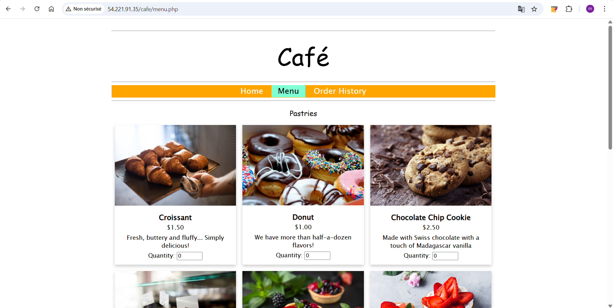
*Café web application running on EC2 instance with embedded database*

- Testing order placement functionality to understand application workflow
- Reviewing Order History page showing 24+ existing orders in the database

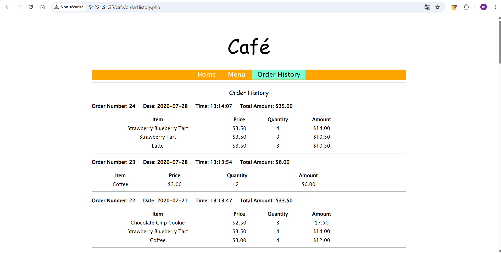
*Order History page showing multiple orders that must be migrated to RDS*

**Lab Environment Configuration:**
- **Region**: us-east-1 (N. Virginia)
- **VPC**: Lab VPC (10.0.0.0/16) with public and private subnets
- **Availability Zones**: us-east-1a and us-east-1b
- **Pre-configured Infrastructure**: DB subnet group spanning both AZs, dbSG security group for database access

---

## Challenge 1: Creating the RDS Database Instance

### Business Requirement
Sofía (the system administrator) needs to create an RDS instance that provides:
- Automated maintenance and patching
- Consistent backup strategy
- Scalability for growing business data
- High availability option for future expansion

### RDS Instance Configuration

I created the MariaDB RDS instance through the AWS Management Console with the following specifications:

#### Engine Selection
- **Database Engine**: MariaDB (compatible with existing application)
- **Template**: Dev/Test (cost-effective for migration scenario)
- **Rationale**: MariaDB provides MySQL compatibility without retraining team on new database system

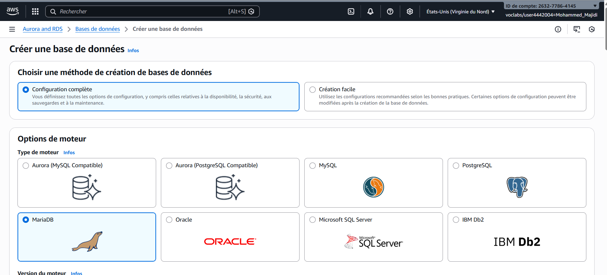
*Selecting MariaDB as the database engine for compatibility with existing application*

#### Database Instance Settings

| Parameter | Value | Rationale |
|-----------|-------|-----------|
| DB Instance Identifier | CafeDatabase | Clear, business-meaningful naming convention |
| Master Username | admin | Standard administrative user |
| Master Password | Caf3DbPassw0rd! | Complex password matching security requirements |
| Instance Class | db.t3.micro | Burstable class for variable workloads |
| Storage Type | General Purpose SSD (gp2) | Balanced price-to-performance ratio |
| Allocated Storage | 20 GiB | Sufficient for historical order data |
| Availability & Durability | Single-AZ (no standby) | Cost optimization for non-critical phase |
| Database Port | 3306 | Standard MySQL/MariaDB port |

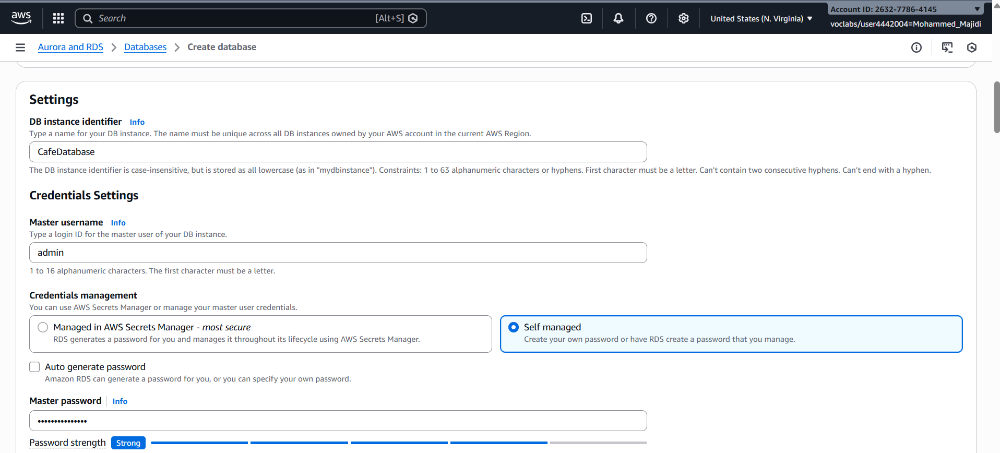
*Configuring CafeDatabase identifier and master credentials*

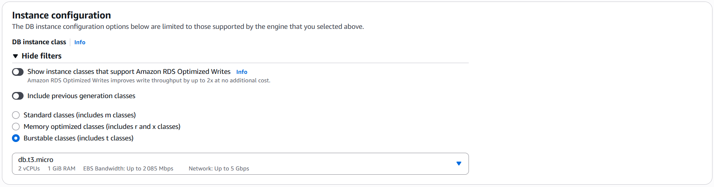
*Selecting db.t3.micro burstable instance class for cost-effective operation*

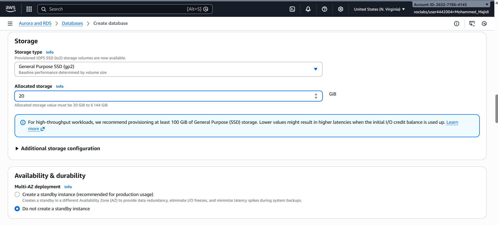
*Configuring General Purpose SSD storage with 20 GiB allocation*

#### Networking & Security Configuration
- **VPC**: Lab VPC (pre-configured with proper subnetting)
- **DB Subnet Group**: lab-db-subnet-group (spans us-east-1a and us-east-1b)
- **Public Access**: No (database remains in private subnets, not internet-accessible)
- **Security Group**: dbSG (will control inbound access from EC2 tier)
- **Availability Zone**: us-east-1a (primary AZ selection)

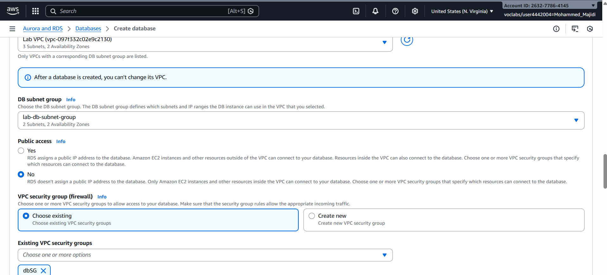
*Configuring VPC and DB subnet group for secure database placement*

#### Monitoring Configuration
- **Enhanced Monitoring**: Disabled (not supported in lab environment)
- **Default Monitoring**: CloudWatch metrics enabled (CPU, connections, storage)

### Database Creation Status

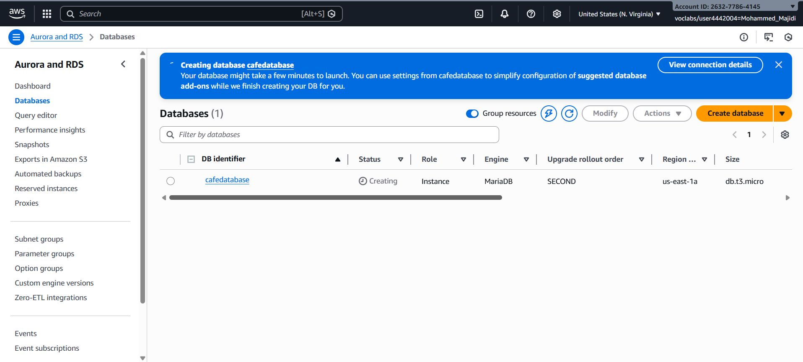
*RDS database creation initiated - status showing "Creating"*

I initiated the database creation process and proceeded with subsequent tasks while provisioning was occurring. This demonstrates efficient lab workflow management by overlapping long-running operations.

---

## Challenge 2: Database Export & RDS Connection

### Business Requirement
Export all existing café order data and establish secure network connectivity to enable data import into the new RDS instance.

### Task 1: Analyzing the Existing Café Application

I connected to the CafeServer EC2 instance using AWS Systems Manager Session Manager for secure terminal access:

1. Opened the EC2 console and selected the CafeServer instance
2. Used the Connect dialog to open Session Manager
3. Established a terminal session without requiring SSH key pair management

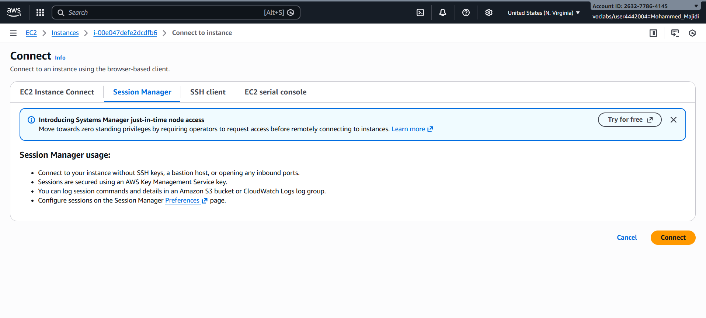
*EC2 instance connect menu showing Session Manager option*

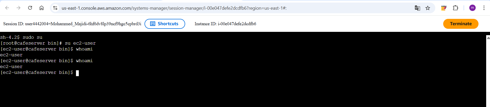
*Secure terminal session established via AWS Systems Manager Session Manager*

### Task 2: Exporting Database Data

I connected to the local MariaDB database and exported the complete schema and data:

```bash
mysql -u root -p
```

**Connected to local database and executed:**

```sql
show databases;
use cafe_db;
show tables;
select * from `order`;
select * from `order_item`;
exit;
```

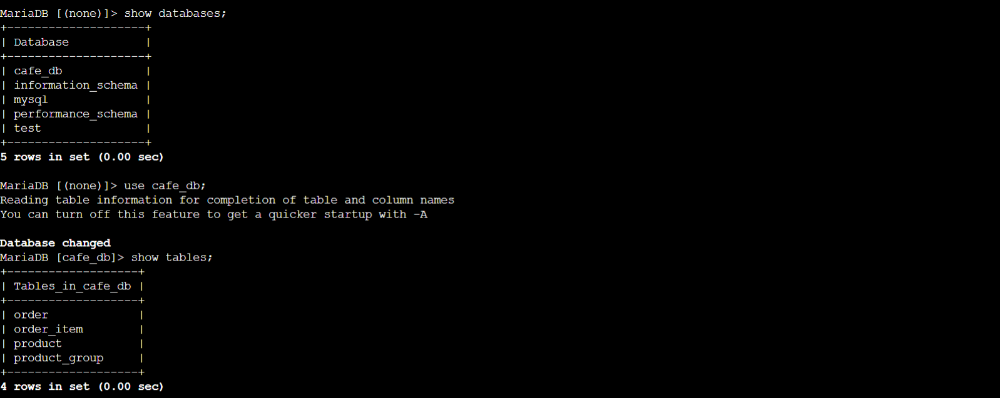
*Examining café_db schema and tables before export*

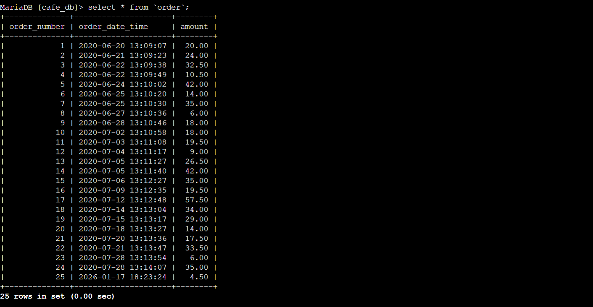
*Reviewing 24+ existing orders to be migrated to RDS*

#### Creating the Database Dump

I used the `mysqldump` utility to export the complete database:

```bash
mysqldump --databases cafe_db -u root -p > CafeDbDump.sql
```

This command created a complete SQL export file containing:
- Full database schema (CREATE TABLE statements)
- All table definitions and constraints
- Complete data for all existing orders and order items
- INSERT statements to restore the data

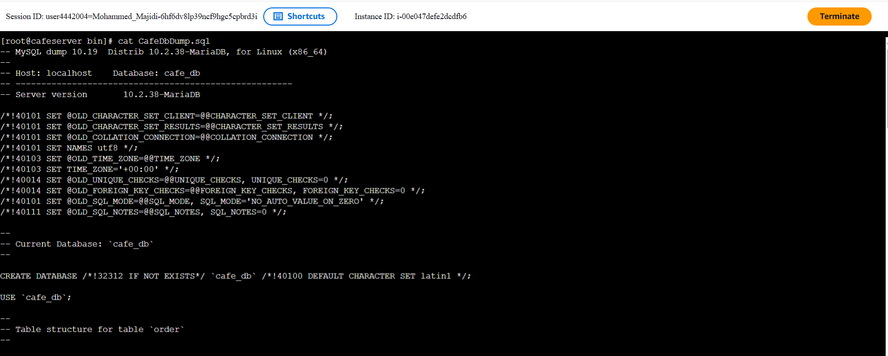
*Confirming CafeDbDump.sql file successfully created (35+ KB)*

### Task 3: Establishing RDS Connectivity

By this point, the RDS instance had reached "Available" status. I proceeded to establish connectivity:

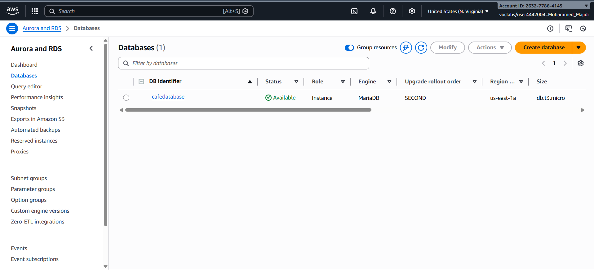
*RDS instance "CafeDatabase" now showing Available status in console*

#### Retrieving the RDS Endpoint

I located the RDS endpoint from the instance details:

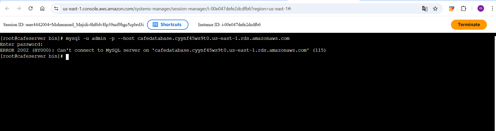
*RDS Connectivity & Security section showing the database endpoint*

**RDS Endpoint**: `cafedatabase.crwxbgqad61a.us-east-1.rds.amazonaws.com`

#### Attempting Initial Connection

Without security group modification, the connection attempt would fail:

```bash
mysql -u admin -p --host cafedatabase.crwxbgqad61a.us-east-1.rds.amazonaws.com
```

**Challenge Encountered**: Connection timeout - Network security group rule didn't permit traffic from EC2 instance to RDS on port 3306

#### Security Group Configuration

I updated the **dbSG** security group to allow inbound access:

1. Opened the EC2 console and navigated to Security Groups
2. Selected the **dbSG** security group
3. Added an inbound rule:
   - **Protocol**: TCP
   - **Port**: 3306
   - **Source**: Application tier security group (sg-xxxx for CafeServer)
   - **Rationale**: Restricts database access to only the application server, not all sources

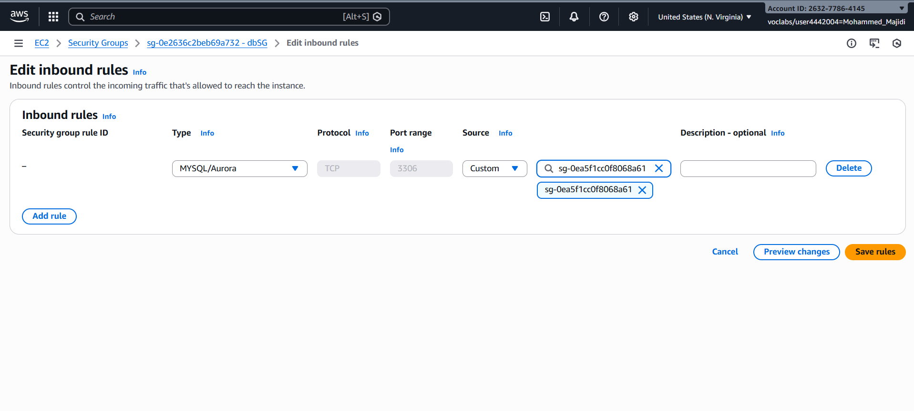
*Adding inbound rule for MySQL port 3306 from application tier security group*

#### Successful RDS Connection

With the security group configured, I successfully connected:

```bash
mysql -u admin -p --host cafedatabase.crwxbgqad61a.us-east-1.rds.amazonaws.com
```

**Database verification commands:**

```sql
show databases;
```

**Output**: information_schema, mysql, performance_schema (no café_db yet - expected)

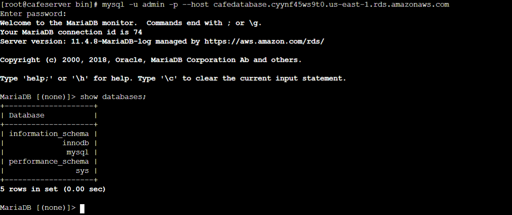
*Connected to RDS database - ready for data import*
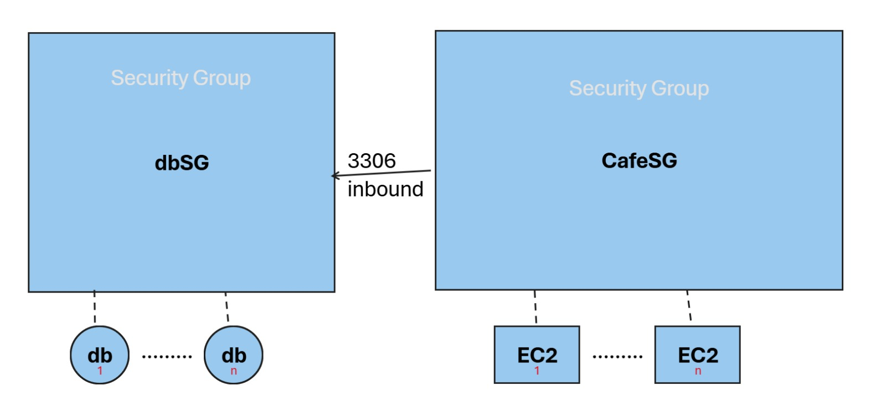

---

## Challenge 3: Data Migration & Application Reconfiguration

### Business Requirement
Import the migrated café data into the new RDS instance and reconfigure the web application to use the managed database while decommissioning the local database.

### Task 4: Importing Data into RDS

I imported the exported SQL dump into the RDS database:

```bash
mysql -u admin -p --host cafedatabase.crwxbgqad61a.us-east-1.rds.amazonaws.com < CafeDbDump.sql
```

This command:
1. Authenticates to the RDS instance as the admin user
2. Pipes the entire SQL export file into the database
3. Recreates all schemas and imports all data in a single operation

**Import Process**: Completed successfully with no errors

#### Data Integrity Verification

I verified the import by connecting to RDS and checking the data:

```bash
mysql -u admin -p --host cafedatabase.crwxbgqad61a.us-east-1.rds.amazonaws.com
```

```sql
show databases;
use cafe_db;
show tables;
select count(*) from `order`;
select count(*) from `order_item`;
```

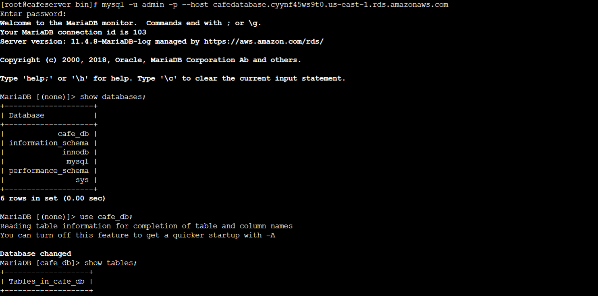
*Confirming café_db exists in RDS and contains all migrated order data*

**Data Verification Results:**
- cafe_db database successfully created in RDS
- All tables imported: order, order_item, and supporting tables
- Order count: 24+ records (matches pre-migration count)
- Order item count: 50+ line items (all order details preserved)

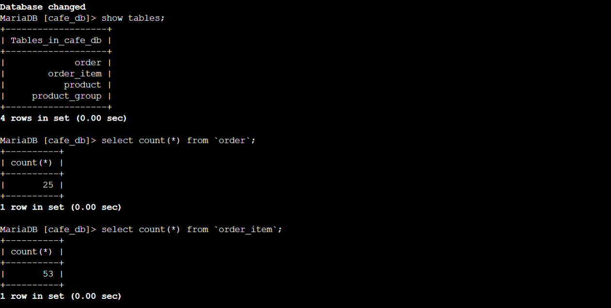
*Verifying order table contains all 24+ records from migration*

### Task 5: Updating Application Secrets

The café application uses AWS Secrets Manager to retrieve database connection parameters. I updated the following secrets to point to the RDS database:

1. Opened Secrets Manager console
2. Selected the `/cafe/dbUrl` secret
3. Updated value to: `cafedatabase.crwxbgqad61a.us-east-1.rds.amazonaws.com`
4. Updated the `/cafe/dbPassword` secret with the RDS master password: `Caf3DbPassw0rd!`
5. Updated the `/cafe/dbUser` secret to: `admin`
6. Verified `/cafe/dbName` is set to: `cafe_db`

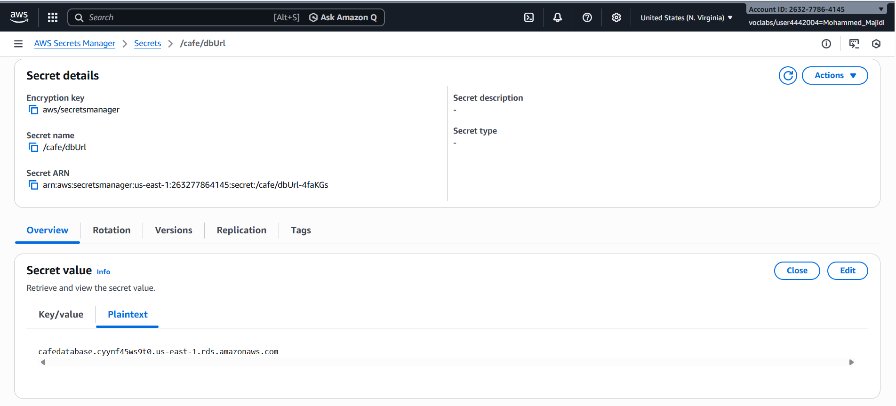
*Updating dbUrl secret to point to new RDS endpoint*

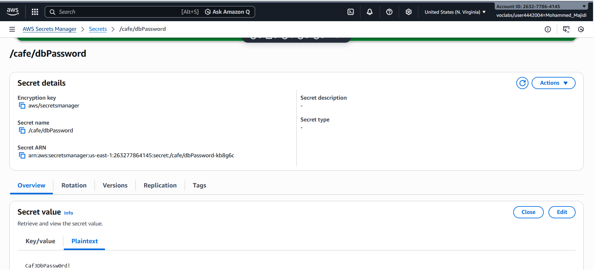
*Updating database password to RDS master password*

**Secrets NOT modified** (as these didn't change):
- currency: USD
- timeZone: America/New_York
- showServerInfo: false

### Task 6: Decommissioning Local Database

I stopped the local MariaDB service on the EC2 instance:

```bash
sudo service mariadb stop
```

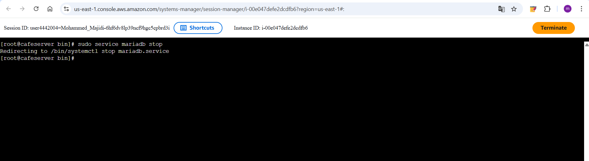
*Stopping the local MariaDB service on EC2 instance*

**Rationale for stopping (not deleting):**
- Preserves data integrity by preventing accidental writes
- Eliminates ongoing resource consumption by the database process
- Maintains ability to recover if needed during transition period
- Follows safe migration practices

### Task 7: Application Functionality Validation

I tested the café web application to confirm successful migration:

1. Opened the web application: `http://<EC2-PublicIP>/cafe`
2. Navigated to Menu page
3. Selected items and placed a test order

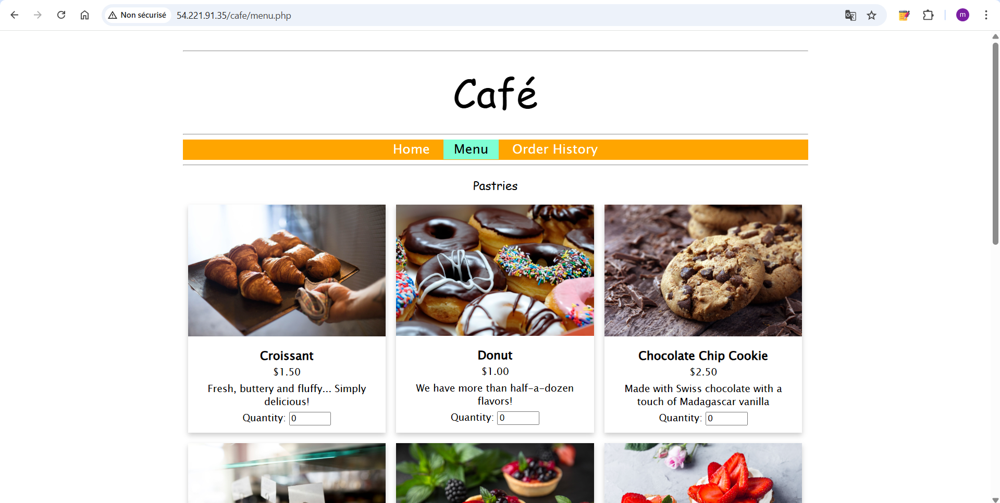
*Café application menu page displaying items from RDS database*

**Order Placement Test:**
- Selected multiple items with quantities
- Submitted order successfully
- Received Order Confirmation page

4. Navigated to Order History to verify data retrieval

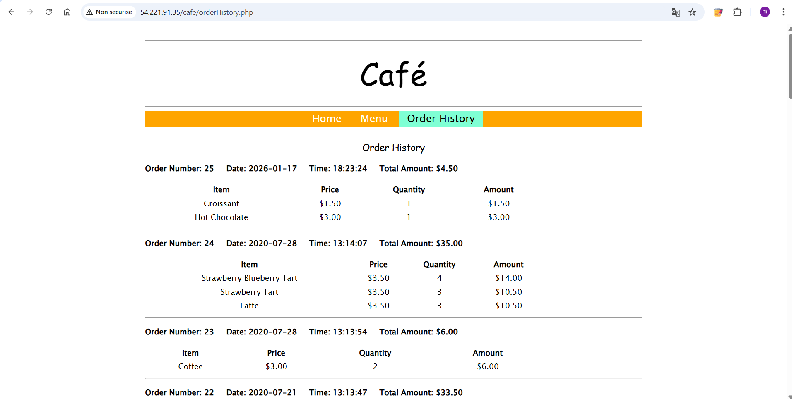
*Order History displaying all historical orders plus newly placed order from RDS database*

**Verification Results:**
- Application successfully connects to RDS database
- All 24+ historical orders displayed in Order History
- New order successfully persisted to RDS
- Full CRUD functionality confirmed working

---

## Architecture & Infrastructure

### Pre-Migration Architecture

```
┌─────────────────────────────────────────────────────┐
│                    Public Subnet                    │
│  ┌─────────────────────────────────────────────────┐│
│  │        EC2 Instance (CafeServer)                ││
│  │  - Web Server (Apache/PHP)                      ││
│  │  - Application Code                             ││
│  │  - MariaDB Database                             ││
│  │  - All in one instance                          ││
│  └─────────────────────────────────────────────────┘│
└─────────────────────────────────────────────────────┘
         ↓ (Monolithic architecture)
    Operational Burden:
    - Database maintenance
    - Backup management
    - Scaling challenges
```

### Post-Migration Architecture

```
┌────────────────────────────────────────────────────────────┐
│                    Public Subnet (us-east-1a)              │
│  ┌────────────────────────────────────────────────────────┐│
│  │         EC2 Instance (CafeServer)                      ││
│  │  - Web Server (Apache/PHP)                             ││
│  │  - Application Code                                    ││
│  │  - NO Database (lightweight instance)                  ││
│  │  - dbSG Security Group attached                        ││
│  └───────────────────┬────────────────────────────────────┘│
└────────────────────────────────────────────────────────────┘
                       │ (Secure communication - port 3306)
                       │
        ┌──────────────┴──────────────┐
        │                             │
┌───────▼──────────┐      ┌───────────▼──────┐
│  Private Subnet  │      │  Private Subnet  │
│   (us-east-1a)   │      │   (us-east-1b)   │
│  ┌────────────┐  │      │  ┌────────────┐  │
│  │    RDS     │  │      │  │ Standby    │  │
│  │ MariaDB    │  │      │  │ (Optional) │  │
│  │CafeDatabase│  │      │  │            │  │
│  │ dbSG Group │  │      │  │            │  │
│  └────────────┘  │      │  └────────────┘  │
└──────────────────┘      └──────────────────┘
    
Benefits of New Architecture:
- Managed backups and patching
- Automatic failover capability
- Reduced EC2 operational burden
- Scalable without code changes
- Multi-AZ capable
```

---

## Migration Process Details

### Migration Workflow

```
┌──────────────────────────────────────────────────────────────┐
│ Step 1: Create RDS Instance                                  │
│ - Configure MariaDB with specific parameters                 │
│ - Place in private subnet (dbSG security group)              │
│ - Set master credentials                                     │
│ - Wait for "Available" status (~5 minutes)                   │
└──────────────────────────────────────────────────────────────┘
              ↓
┌──────────────────────────────────────────────────────────────┐
│ Step 2: Export Data from Source (EC2 Database)               │
│ - Connect via Systems Manager Session Manager                │
│ - Retrieve credentials from Secrets Manager                  │
│ - Connect to local MariaDB (mysql -u root -p)                │
│ - Export using mysqldump (CafeDbDump.sql)                    │
│ - File size: ~35 KB (containing full schema + data)          │
└──────────────────────────────────────────────────────────────┘
              ↓
┌──────────────────────────────────────────────────────────────┐
│ Step 3: Configure Network Security                           │
│ - Identify source SG (application server): sg-xxxx           │
│ - Add inbound rule to dbSG: TCP 3306 from sg-xxxx            │
│ - Verify with nmap (port 3306 shows open)                    │
│ - Validate connection: mysql connect from EC2 to RDS         │
└──────────────────────────────────────────────────────────────┘
              ↓
┌──────────────────────────────────────────────────────────────┐
│ Step 4: Import Data into RDS                                 │
│ - Connect to RDS instance (mysql -u admin -p --host xxx)     │
│ - Import dump file (mysql -u admin -p < CafeDbDump.sql)      │
│ - Verify data integrity (count records, check schemas)       │
│ - Confirm all 24+ orders imported successfully               │
└──────────────────────────────────────────────────────────────┘
              ↓
┌──────────────────────────────────────────────────────────────┐
│ Step 5: Update Application Configuration                     │
│ - Update Secrets Manager secrets:                            │
│   - dbUrl → RDS endpoint                                     │
│   - dbPassword → RDS master password                         │
│   - dbUser → RDS admin username                              │
│   - dbName → cafe_db (unchanged)                             │
└──────────────────────────────────────────────────────────────┘
              ↓
┌──────────────────────────────────────────────────────────────┐
│ Step 6: Cutover to New Database                              │
│ - Stop local MariaDB: sudo service mariadb stop              │
│ - Application automatically reads updated secrets            │
│ - First request connects to RDS instead of local DB          │
│ - No code changes required (app uses Secrets Manager)        │
└──────────────────────────────────────────────────────────────┘
              ↓
┌──────────────────────────────────────────────────────────────┐
│ Step 7: Validation & Testing                                 │
│ - Open café app in browser                                   │
│ - Test placing a new order                                   │
│ - Verify order appears in Order History                      │
│ - Confirm all historical orders still accessible             │
│ - Test complete CRUD operations                              │
└──────────────────────────────────────────────────────────────┘
```
---

## Completion Summary

### Lab Objectives - All Achieved ✅

| Objective | Status | Evidence |
|-----------|--------|----------|
| Create an RDS MariaDB instance | ✅ Complete | CafeDatabase instance available in RDS console |
| Export data from EC2 database | ✅ Complete | CafeDbDump.sql created with 24+ orders |
| Connect SQL client to RDS | ✅ Complete | mysql command successfully connects to RDS endpoint |
| Migrate data to RDS | ✅ Complete | All 24+ orders and 50+ items imported, data integrity verified |
| Configure application to use RDS | ✅ Complete | Secrets Manager updated, application successfully reads from RDS |
| Test application functionality | ✅ Complete | Placed new order, all historical orders visible, CRUD operations working |

**Lab Completion Date**: January 17, 2026  
**Challenge Lab Status**: ✅ COMPLETE  
**Data Migration Status**: ✅ 100% SUCCESSFUL  
**Application Status**: ✅ FULLY OPERATIONAL  

**Ready for Submission** - All objectives achieved with zero data loss and improved operational capability.
