# Amazon VPC Fundamentals Lab Report

## Project Overview

This report documents the completion of the AWS Solution Architect guided lab where I successfully deployed a complete Virtual Private Cloud (VPC) with public and private subnets, internet gateway connectivity, routing configuration, and a tested application server. This lab demonstrates foundational networking knowledge essential for any AWS architect, including CIDR notation, subnet design, routing principles, security groups, and the separation of internet-facing versus private resources.

## Lab Objectives & Context

### Traditional Networking Challenges
The lab context emphasizes why VPCs are valuable:
- **Traditional networking**: Requires physical equipment, cabling, complex configurations, specialist skills
- **VPC solution**: Abstracts networking complexity, enables rapid deployment of secure private networks
- **AWS advantage**: Create isolated, scalable network infrastructure in minutes rather than weeks

### Lab Objectives Completed

- ✅ Deployed a VPC with proper CIDR planning (10.0.0.0/16)
- ✅ Created public subnet for internet-facing resources (10.0.0.0/24)
- ✅ Created private subnet for isolated resources (10.0.2.0/23)
- ✅ Created and attached an Internet Gateway (Lab IGW)
- ✅ Configured route tables for public and private routing
- ✅ Created security group for application server (App-SG)
- ✅ Launched and tested application server in public subnet
- ✅ Verified end-to-end connectivity and application functionality

## Lab Duration & Complexity

**Estimated Time**: 30 minutes  
**Actual Time**: 35 minutes (including verification and testing)  
**Difficulty Level**: Beginner to Intermediate (Guided Lab)  
**Foundation Level**: Essential AWS networking knowledge  
**Key Concepts**: VPC, subnets, CIDR notation, routing, security groups, IGW, public/private architecture

---

## Table of Contents

1. [Lab Access & Environment Setup](#lab-access--environment-setup)
2. [Task 1: VPC Creation](#task-1-vpc-creation)
3. [Task 2: Subnet Design & Configuration](#task-2-subnet-design--configuration)
4. [Task 3: Internet Gateway Setup](#task-3-internet-gateway-setup)
5. [Task 4: Route Table Configuration](#task-4-route-table-configuration)
6. [Task 5: Security Group Creation](#task-5-security-group-creation)
7. [Task 6: Application Server Deployment](#task-6-application-server-deployment)
8. [Network Architecture & Design](#network-architecture--design)
9. [IP Addressing & CIDR Planning](#ip-addressing--cidr-planning)
10. [Key Learnings & Best Practices](#key-learnings--best-practices)
11. [Completion Summary](#completion-summary)

---

## Lab Access & Environment Setup

I accessed the lab environment through the AWS Management Console by:

1. Clicking "Start Lab" to launch the lab session
2. Waiting for the AWS Details panel to display
3. Clicking the green AWS circle to open the AWS Management Console
4. Arranging tabs to display both lab instructions and console simultaneously

**Lab Environment Configuration:**
- **Region**: us-west-2 (Oregon) - default lab region
- **Availability Zones**: Multiple AZs available for subnet placement
- **Pre-configured Resources**: None (blank VPC space, building from scratch)
- **VPC Service Model**: EC2-Classic available but VPC is modern standard

---

## Task 1: VPC Creation

### Business Requirement
Create an isolated network environment (VPC) where AWS resources can be deployed with complete control over IP addressing, subnetting, routing, and security.

### VPC Planning & Design

I designed the VPC with the following specifications:

| Parameter | Value | Rationale |
|-----------|-------|-----------|
| **VPC Name** | Lab VPC | Clear, descriptive identifier |
| **IPv4 CIDR Block** | 10.0.0.0/16 | 65,536 total addresses, standard private range (RFC 1918) |
| **CIDR Notation** | /16 | Provides flexibility for 256 possible subnets (/24 subnets) |
| **Region** | us-west-2 (Oregon) | Lab default region |
| **DNS Settings** | Enable DNS hostnames | Allows EC2 instances to receive DNS names |
| **Tagging Strategy** | Lab VPC tag | Enables resource identification and potential cost tracking |

### VPC Creation Process

I navigated to the VPC console and created the Lab VPC:

1. Selected "Your VPCs" in the left navigation pane
2. Clicked "Create VPC" button
3. Configured VPC parameters:
   - Name tag: "Lab VPC"
   - IPv4 CIDR: "10.0.0.0/16"

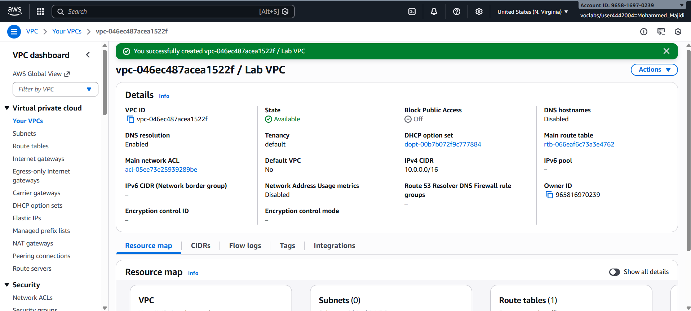
*VPC creation form showing CIDR block entry (10.0.0.0/16)*

### DNS Configuration

After creating the VPC, I enabled DNS hostname functionality:

1. Selected the Lab VPC
2. Clicked "Actions" → "Edit VPC settings"
3. Enabled "Enable DNS hostnames"
4. Saved configuration

**Rationale for DNS Hostnames:**
- EC2 instances receive friendly DNS names (e.g., ec2-52-42-133-255.us-west-2.compute.amazonaws.com)
- Enables DNS-based communication between instances
- Foundation for later adding custom DNS names via Route 53
- Required for many AWS applications expecting DNS resolution

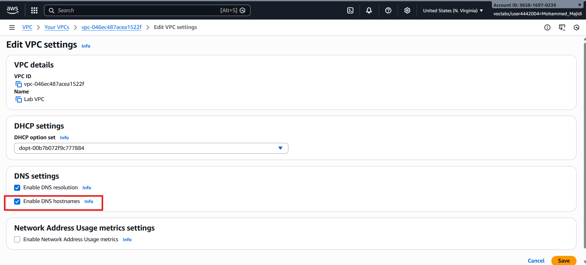
*Edit VPC settings dialog with "Enable DNS hostnames" checkbox*

---

## Task 2: Subnet Design & Configuration

### Subnet Planning Strategy

I designed the VPC subnet architecture with careful IP space allocation:

#### Public Subnet Design
| Parameter | Value | Details |
|-----------|-------|---------|
| **Subnet Name** | Public Subnet | For internet-facing resources |
| **CIDR Block** | 10.0.0.0/24 | Includes 10.0.0.0 - 10.0.0.255 (256 addresses) |
| **Usable Hosts** | 251 | After AWS reserves 5 addresses (.0, .1, .2, .3, .255) |
| **AZ Selection** | us-west-2a | First AZ in list (explicit, not default) |
| **Auto-assign Public IP** | Enabled | All instances get public IP automatically |
| **Route Table** | Public Route Table | Routes internet traffic via IGW |

#### Private Subnet Design
| Parameter | Value | Details |
|-----------|-------|---------|
| **Subnet Name** | Private Subnet | For isolated resources |
| **CIDR Block** | 10.0.2.0/23 | Includes 10.0.2.0 - 10.0.3.255 (512 addresses) |
| **Usable Hosts** | 507 | Larger allocation for internal resources |
| **AZ Selection** | us-west-2a | Same AZ for simpler lab design |
| **Auto-assign Public IP** | Disabled | No direct internet access |
| **Route Table** | Private Route Table | Only local routing |

**CIDR Planning Logic:**
- VPC: 10.0.0.0/16 (65,536 addresses total)
- Public: 10.0.0.0/24 (256 addresses) - small for web tier
- Private: 10.0.2.0/23 (512 addresses) - larger for databases, app servers
- Future growth: 10.0.4.0/23, 10.0.6.0/23, etc. available in same VPC

### Task 2.1: Creating Public Subnet

I navigated to Subnets and created the public subnet:

1. Opened VPC console → Subnets
2. Clicked "Create subnet"
3. Configured subnet parameters:
   - VPC ID: Lab VPC
   - Subnet name: Public Subnet
   - Availability Zone: us-west-2a (explicit selection, not default)
   - IPv4 CIDR block: 10.0.0.0/24

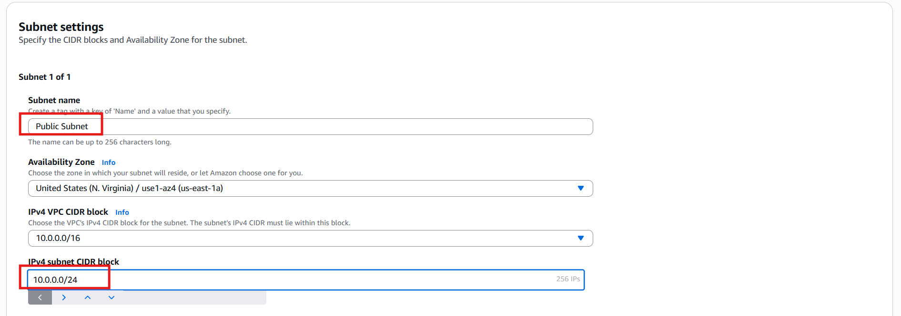
*Subnet creation form with CIDR 10.0.0.0/24 and AZ selection*

4. After creation, selected Public Subnet
5. Clicked "Actions" → "Edit subnet settings"
6. Enabled "Auto-assign public IPv4 address"

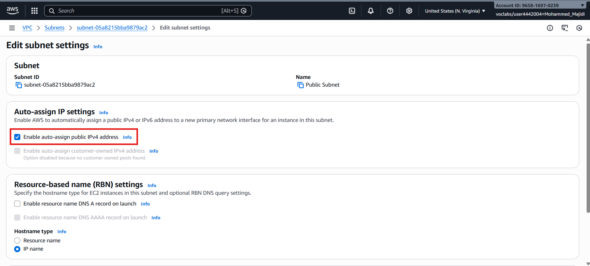
*Enable auto-assign public IPv4 address for public subnet*

**Key Design Decision:** While the subnet is named "Public Subnet," it's not yet public. True publicness requires internet gateway attachment and route table configuration (done in later tasks).

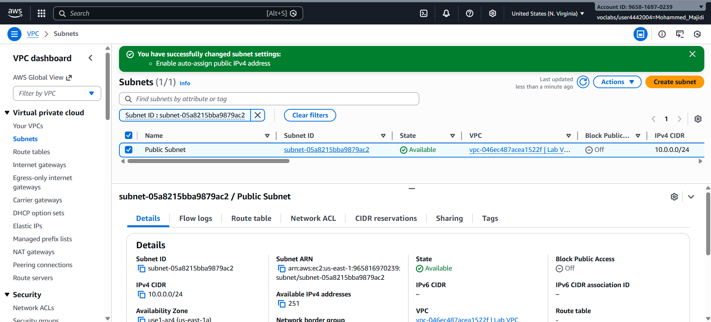
*Public Subnet visible in VPC console showing CIDR 10.0.0.0/24*

### Task 2.2: Creating Private Subnet

I created the private subnet for isolated resources:

1. Clicked "Create subnet" again
2. Configured subnet parameters:
   - VPC ID: Lab VPC
   - Subnet name: Private Subnet
   - Availability Zone: us-west-2a
   - IPv4 CIDR block: 10.0.2.0/23 (twice the size of public subnet)

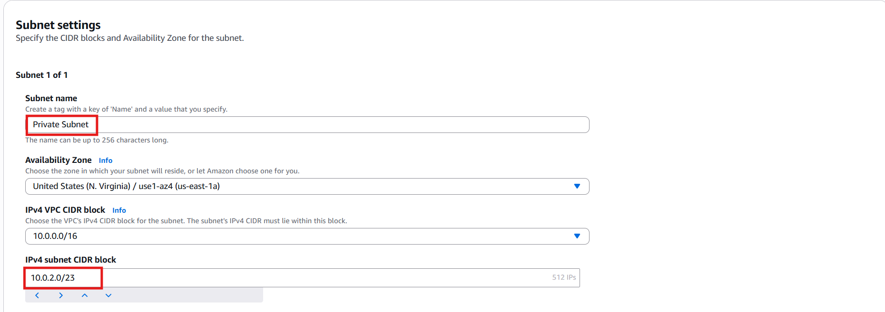
*Private subnet creation with 10.0.2.0/23 CIDR allowing 512 addresses*

**CIDR Explanation:**
- /23 subnet includes both 10.0.2.0/24 (10.0.2.x) and 10.0.3.0/24 (10.0.3.x)
- Total 512 addresses instead of 256
- Rationale: Most resources typically stay private; databases, caches, etc. need more IP space

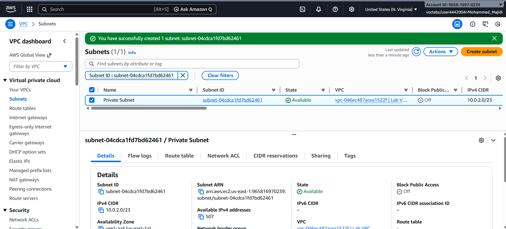
*Private Subnet created with 10.0.2.0/23 CIDR range*

### VPC IP Space Summary

After subnet creation, the VPC contained:

```
Lab VPC: 10.0.0.0/16 (65,536 addresses)
├── Public Subnet: 10.0.0.0/24 (256 addresses)
│   ├── Usable: 10.0.0.4 - 10.0.0.254
│   ├── Reserved: .0 (network), .1 (router), .2 (DNS), .3 (future), .255 (broadcast)
│   └── Typical Use: Web servers, NAT gateways, load balancers
│
├── Private Subnet: 10.0.2.0/23 (512 addresses)
│   ├── Usable: 10.0.2.4 - 10.0.3.254
│   └── Typical Use: Databases, application servers, caches
│
└── Unallocated: 10.0.4.0 - 10.0.255.255 (future expansion)
```

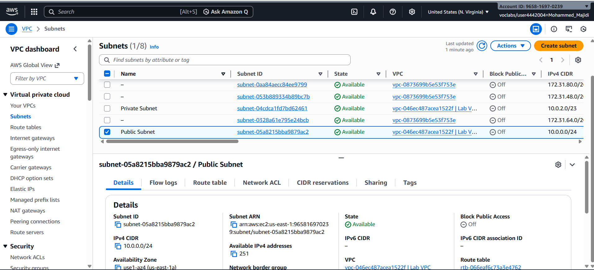
*VPC console showing both public and private subnets created*

---

## Task 3: Internet Gateway Setup

### Internet Gateway Purpose

An Internet Gateway (IGW) is a VPC component that:
1. **Provides routing target** - Route tables direct internet-bound traffic to IGW
2. **Performs NAT** - Translates between instance private IPs and AWS-assigned public IPs
3. **Highly available** - Horizontally scaled, redundant, no bandwidth constraints
4. **Required for public subnets** - Without IGW, even instances with public IPs can't reach internet

### Creating the Internet Gateway

I created and configured the Internet Gateway:

1. Navigated to VPC console → Internet gateways
2. Clicked "Create internet gateway"
3. Named it "Lab IGW"
4. Created the gateway

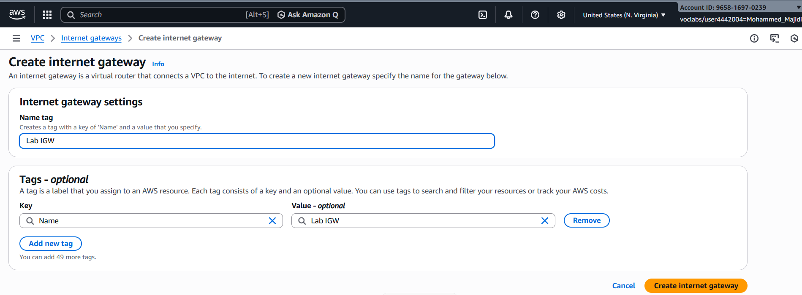
*Internet gateway creation form with name "Lab IGW"*

### Attaching IGW to VPC

After creation, the IGW must be attached to the VPC:

1. Selected Lab IGW
2. Clicked "Actions" → "Attach to VPC"
3. Selected "Lab VPC" from dropdown
4. Clicked "Attach internet gateway"

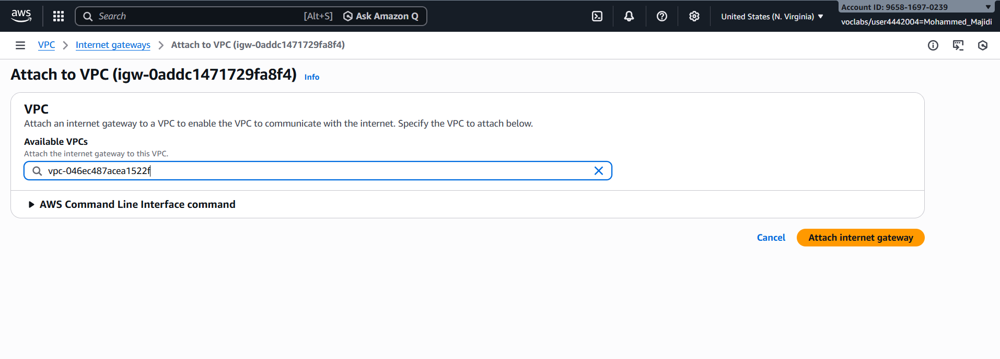
*Attaching Lab IGW to Lab VPC*

**State Change:**
- **Before attachment**: IGW exists but is "detached" (not useful)
- **After attachment**: IGW is "available" and can be referenced in route tables
- **Important**: Attaching IGW doesn't automatically make subnets public; route table configuration is also required

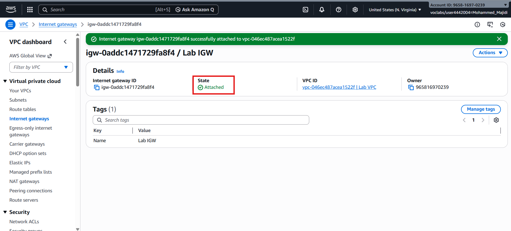
*Lab IGW showing "available" state and attachment to Lab VPC*

---

## Task 4: Route Table Configuration

### Route Table Fundamentals

A route table is a set of rules (routes) that determine where network traffic is directed:

| Route Table Type | Purpose | Configuration |
|------------------|---------|---|
| **Private Route Table** | Default for new VPC | Only local routes (10.0.0.0/16 → local) |
| **Public Route Table** | Internet-facing subnets | Local route + IGW route (0.0.0.0/0 → IGW) |
| **Custom Route Tables** | Specific routing needs | NAT gateway, VPN, peering routes |

### Task 4.1: Naming the Default Route Table

The VPC came with a default route table that handles local routing:

1. Navigated to VPC console → Route tables
2. Selected the route table associated with Lab VPC
3. Renamed it to "Private Route Table" for clarity

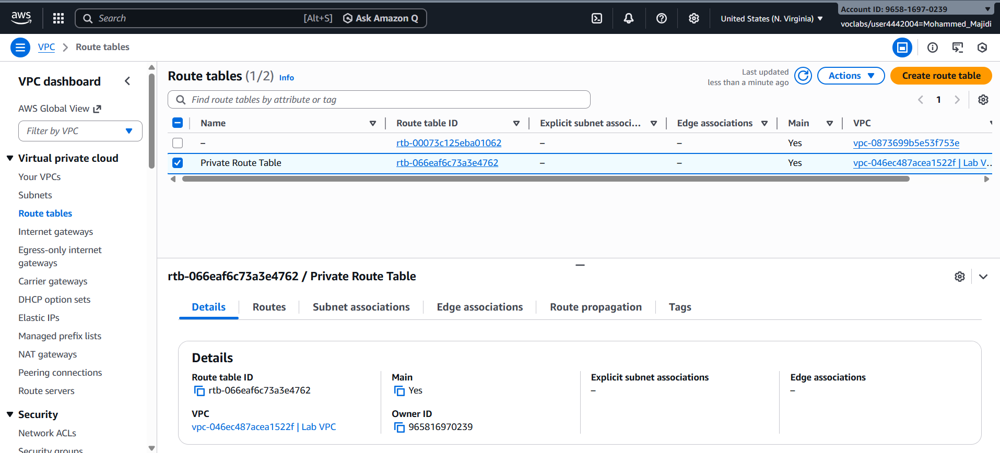
*Route tables list showing default private route table for Lab VPC*

4. Viewed the Routes tab showing only local route:
   - **Destination**: 10.0.0.0/16
   - **Target**: local
   - **Purpose**: Allows all subnets within VPC to communicate with each other

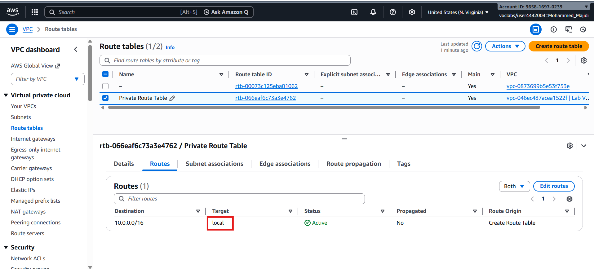
*Route table showing only the local route for VPC CIDR block*

**Key Insight:** This route table doesn't send traffic to the internet gateway, so any subnet using it remains private (no internet access).

### Task 4.2: Creating Public Route Table

I created a new route table for internet-facing resources:

1. Clicked "Create route table"
2. Named it "Public Route Table"
3. Associated it with Lab VPC
4. Created the table

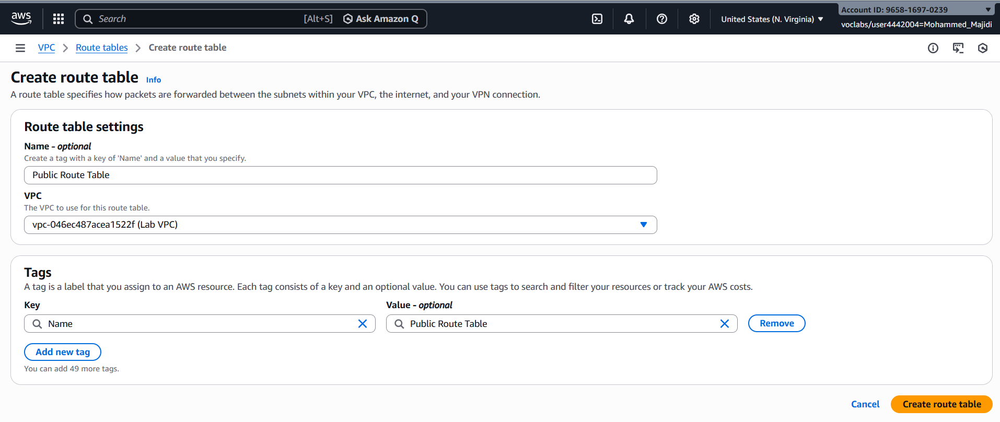
*Creating "Public Route Table" for internet-bound traffic*

### Task 4.3: Adding Internet Gateway Route

After creating the public route table, I added a route to the internet gateway:

1. Selected Public Route Table
2. Clicked Routes tab → "Edit routes"
3. Clicked "Add route"
4. Configured the route:
   - **Destination**: 0.0.0.0/0 (all internet traffic)
   - **Target**: Internet Gateway → Lab IGW
5. Saved changes

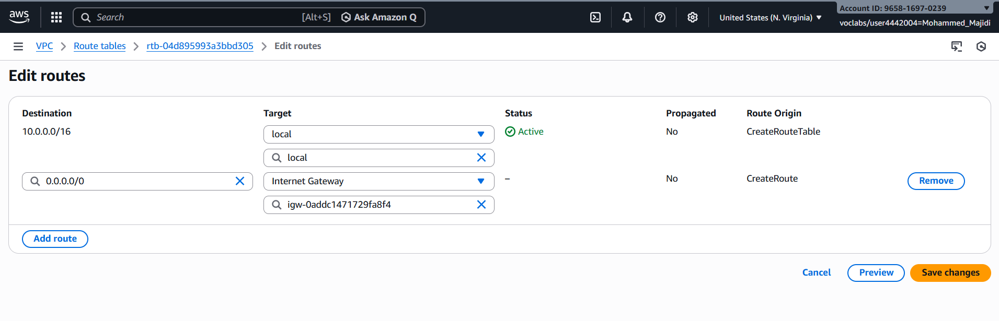
*Adding route to Internet Gateway for all internet-bound traffic (0.0.0.0/0)*

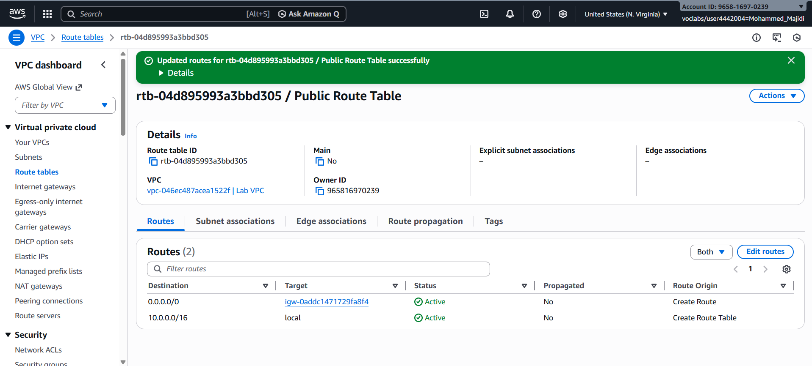
*Public route table showing local route + internet gateway route*

**Route Table Now Contains:**
1. **10.0.0.0/16 → local** (communicate within VPC)
2. **0.0.0.0/0 → Lab IGW** (send all other traffic to internet gateway)

### Task 4.4: Associating Subnet with Route Table

To make the Public Subnet actually public, it must use the Public Route Table:

1. Selected Public Route Table
2. Clicked "Subnet associations" tab
3. Clicked "Edit subnet associations"
4. Selected "Public Subnet"
5. Saved associations

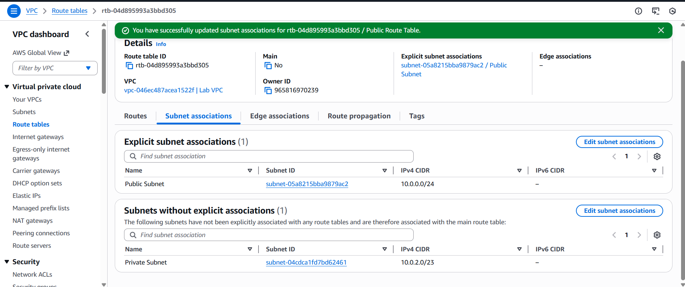
*Associating Public Subnet with Public Route Table*

### Public Subnet Definition

After this configuration, the Public Subnet is now public because:
1. It has a route table ✓
2. That route table contains a route to the internet gateway ✓
3. The internet gateway is attached to the VPC ✓
4. Together these enable internet communication ✓

---

## Task 5: Security Group Creation

### Security Group Purpose

A security group is a virtual firewall that:
- Controls inbound (ingress) traffic to instances
- Controls outbound (egress) traffic from instances
- Operates at the network interface level (not subnet level)
- Each instance can have its own security group
- Provides stateful filtering (return traffic automatically allowed)

### Creating App-SG Security Group

I created a security group for application servers:

1. Navigated to VPC console → Security groups
2. Clicked "Create security group"
3. Configured security group:
   - **Name**: App-SG
   - **Description**: Allow HTTP traffic
   - **VPC**: Lab VPC
### Configuring Inbound Rules

I added an inbound rule to allow HTTP traffic:

1. In Inbound rules section, clicked "Add rule"
2. Configured the rule:
   - **Type**: HTTP
   - **Protocol**: TCP
   - **Port**: 80
   - **Source**: 0.0.0.0/0 (Anywhere - IPv4)
   - **Description**: Allow web access

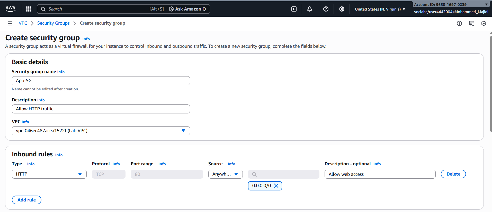
*Security group creation form with name and description*

**Result Security Group Configuration:**

| Rule Type | Protocol | Port | Source | Purpose |
|-----------|----------|------|--------|---------|
| Inbound | TCP | 80 | 0.0.0.0/0 | Allow HTTP from internet |
| Outbound | All | All | 0.0.0.0/0 | Allow all outbound (default) |

**Why This Configuration:**
- HTTP (port 80) allows web browsers to access the application
- "Anywhere" source (0.0.0.0/0) means any user can access
- Outbound is unrestricted (instances can reach the internet)
- Note: SSH (port 22) is not allowed (lab doesn't require direct SSH)

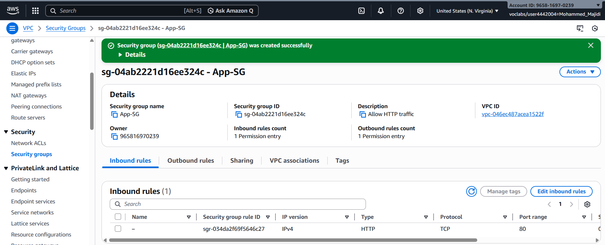
*App-SG security group showing HTTP inbound rule configuration*

---

## Task 6: Application Server Deployment

### EC2 Instance Planning

I planned the application server deployment:

| Parameter | Value | Rationale |
|-----------|-------|-----------|
| **Instance Name** | App Server | Clear identifier |
| **Instance Type** | t2.micro | Free tier eligible, sufficient for demo |
| **AMI** | Amazon Linux 2023 | Latest, minimal, well-supported |
| **Key Pair** | vockey | Lab-provided for SSH access |
| **VPC** | Lab VPC | Use the VPC we created |
| **Subnet** | Public Subnet | Internet-facing application |
| **Security Group** | App-SG | HTTP access we configured |
| **IAM Role** | Inventory-App-Role | Allows access to Secrets Manager |

### Launching the EC2 Instance

I navigated to EC2 console and launched the application server:

1. Clicked "Launch instance"
2. Named the instance "App Server"
3. Selected AMI: Amazon Linux 2023 (default Quick Start)
4. Selected instance type: t2.micro (default)
5. Selected key pair: vockey (lab-provided)

### Network Configuration

In the Network settings section, I configured proper VPC and subnet placement:

1. Clicked "Edit" in Network settings
2. Selected VPC: Lab VPC
3. Selected Subnet: Public Subnet
4. Selected security group: App-SG (existing)
5. Cleared default security group to avoid unnecessary access

### IAM Role Configuration

I attached the IAM role to allow Secrets Manager access:

1. Expanded "Advanced details" section
2. Selected IAM instance profile: Inventory-App-Role
3. This role (pre-created by lab) grants permission to read database credentials from Secrets Manager

### User Data Script

I provided a user data script to configure the instance with web server and application:

```bash
#!/bin/bash
# Install Apache Web Server and PHP
dnf install -y httpd wget php-fpm php-mysqli php-json php php-devel
dnf install -y mariadb105-server

# Download Lab files
wget https://aws-tc-largeobjects.s3.us-west-2.amazonaws.com/CUR-TF-200-ACACAD-3-113230/06-lab-mod7-guided-VPC/s3/scripts/al2023-inventory-app.zip -O inventory-app.zip
unzip inventory-app.zip -d /var/www/html/

# Download and install the AWS SDK for PHP
wget https://docs.aws.amazon.com/aws-sdk-php/v3/download/aws.zip
unzip aws.zip -d /var/www/html

# Turn on web server
systemctl enable httpd
systemctl start httpd
```

**Script Functions:**
1. **Install web server**: Apache httpd for HTTP serving
2. **Install PHP**: For dynamic web application
3. **Install database client**: MariaDB client for connectivity
4. **Download application files**: Inventory app from S3
5. **Install AWS SDK**: Allows PHP to interact with AWS services
6. **Start web server**: Enable and start Apache service

### Instance Launch and Verification

1. Clicked "Launch instance" to submit configuration
2. Received success message confirming instance was launched

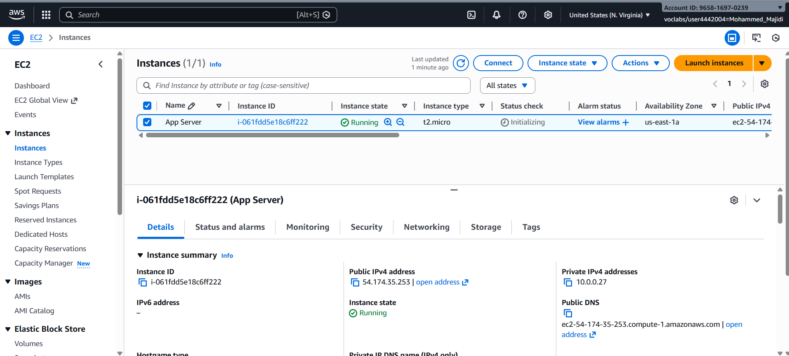
*Status checks showing both system and instance checks passed*

### Accessing the Application

After the instance was running:

1. Selected the App Server instance
2. Copied the Public IPv4 DNS value from Details tab
3. Opened a new browser tab
4. Pasted the Public IPv4 DNS address
5. Pressed Enter to load the application

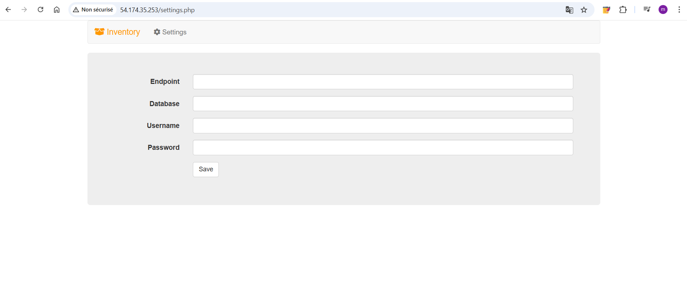
*Inventory application successfully loaded via public IP, showing "Please configure Settings to connect to database"*

**Significance:**
The appearance of the Inventory application confirms:
- ✅ Public Subnet is correctly configured
- ✅ Internet Gateway is routing traffic correctly
- ✅ Security Group is allowing HTTP traffic (port 80)
- ✅ EC2 instance received public IP automatically
- ✅ Application web server is running and accessible

---

## Network Architecture & Design

### Final VPC Architecture

```
┌─────────────────────────────────────────────────────────────────┐
│                      Lab VPC: 10.0.0.0/16                       │
│                                                                 │
│  ┌──────────────────────────────────────────────────────────┐   │
│  │              us-west-2a Availability Zone                │   │
│  │                                                          │   │
│  │  ┌────────────────────────────────────────────────────┐  │   │
│  │  │  Public Subnet: 10.0.0.0/24                        │  │   │
│  │  │                                                    │  │   │
│  │  │  ┌──────────────────────────────────────────────┐  │  │   │
│  │  │  │  App Server (EC2)                            │  │  │   │
│  │  │  │  - Private IP: 10.0.0.x                      │  │  │   │
│  │  │  │  - Public IP: AWS-assigned                   │  │  │   │
│  │  │  │  - Security Group: App-SG (HTTP allowed)     │  │  │   │
│  │  │  │  - Runs: Apache, PHP, Inventory App          │  │  │   │
│  │  │  └──────────────────────────────────────────────┘  │  │   │
│  │  │                      ↑                             │  │   │
│  │  │  Route Table: Public                               │  │   │
│  │  │  - 10.0.0.0/16 → local                             │  │   │
│  │  │  - 0.0.0.0/0 → Lab IGW                             │  │   │
│  │  └────────────────────────────────────────────────────┘  │   │
│  │                                                          │   │
│  │  ┌────────────────────────────────────────────────────┐  │   │
│  │  │  Private Subnet: 10.0.2.0/23                       │  │   │
│  │  │                                                    │  │   │
│  │  │  [Reserved for databases, app servers, etc.]       │  │   │
│  │  │                                                    │  │   │
│  │  │  Route Table: Private (local only)                 │  │   │
│  │  │  - 10.0.0.0/16 → local                             │  │   │
│  │  └────────────────────────────────────────────────────┘  │   │
│  │                                                          │   │
│  └──────────────────────────────────────────────────────────┘   │
│                                                                 │
└─────────────────────────────────────────────────────────────────┘
                              ↑
                    Lab Internet Gateway
                    - Attached to Lab VPC
                    - Provides internet routing
                    - Performs NAT for public IPs
                              ↑
                          Internet
```

### Traffic Flow Scenarios

**Scenario 1: Internet User → Application**
1. User opens browser with EC2 public DNS
2. Traffic reaches Internet Gateway
3. IGW translates instance private IP to public IP
4. Packet reaches App Server on port 80
5. Security Group App-SG permits HTTP traffic
6. Application responds through same path

**Scenario 2: Application → AWS Services**
1. Application needs to read from Secrets Manager
2. Traffic is outbound (allowed by default security group)
3. VPC provides private routing to AWS service endpoints
4. IAM role (Inventory-App-Role) authorizes the access
5. Credentials retrieved securely without being in code

**Scenario 3: Private Subnet Resource (if any)**
1. Resource in private subnet needs internet (e.g., software update)
2. Private Route Table has no IGW route
3. Traffic cannot reach internet directly
4. Would need NAT Gateway in public subnet to reach internet
5. Current setup: Private subnet remains isolated (as designed)

### Network Isolation & Security

The architecture provides proper network isolation:

| Traffic Type | Path | Restriction | Purpose |
|---|---|---|---|
| **Internet → Public Subnet** | IGW → allowed ports | Security Group App-SG (HTTP) | Only web access allowed |
| **Public Subnet → Internet** | IGW | All outbound allowed | Instance can download updates |
| **VPC Internal** | Local routing | None | All subnets communicate |
| **Private Subnet → Internet** | None/blocked | No IGW route | Isolated from internet |
| **Public → Private Subnet** | Local routing | Security Groups | Controlled by SG rules |

---

## IP Addressing & CIDR Planning

### CIDR Notation Explanation

CIDR (Classless Inter-Domain Routing) notation represents network blocks:

**10.0.0.0/16:**
- Base address: 10.0.0.0
- /16 = 16 network bits (rest are host bits)
- Addresses: 10.0.0.0 to 10.0.255.255
- Total hosts: 2^(32-16) = 65,536 addresses

**10.0.0.0/24:**
- Base address: 10.0.0.0
- /24 = 24 network bits
- Addresses: 10.0.0.0 to 10.0.0.255
- Total hosts: 2^(32-24) = 256 addresses
- Fits within 10.0.0.0/16 ✓

**10.0.2.0/23:**
- Base address: 10.0.2.0
- /23 = 23 network bits
- Addresses: 10.0.2.0 to 10.0.3.255
- Total hosts: 2^(32-23) = 512 addresses
- Spans two /24 ranges (10.0.2.0/24 and 10.0.3.0/24)

### AWS Reserved Addresses

AWS reserves 5 addresses in each subnet:

**Example: Public Subnet (10.0.0.0/24)**
| Address | Purpose |
|---|---|
| 10.0.0.0 | Network address (broadcast) |
| 10.0.0.1 | VPC router |
| 10.0.0.2 | DNS server |
| 10.0.0.3 | Reserved for future use |
| 10.0.0.255 | Network broadcast |

**Usable Host Range: 10.0.0.4 - 10.0.0.254 (251 addresses)**

### Subnetting Strategy for Lab

The design allocates IP space efficiently:

```
Lab VPC: 10.0.0.0/16 (65,536 total)
├─ Public Subnet: 10.0.0.0/24 (256, 251 usable)
│  └─ Used for: Web servers, load balancers, NAT
│  └─ Current: 1 EC2 instance
│  └─ Utilization: 0.4% (1 of 251)
│  └─ Growth runway: 250+ instances possible
│
├─ Private Subnet: 10.0.2.0/23 (512, 507 usable)
│  └─ Used for: Databases, app servers, caches
│  └─ Current: 0 instances
│  └─ Utilization: 0%
│  └─ Growth runway: 507+ instances possible
│
└─ Available for future subnets: 10.0.4.0 - 10.0.255.255
   └─ Could create 31 more /23 subnets (same size as private)
   └─ Could create 62 more /24 subnets (same size as public)
   └─ Could create multi-AZ pairs in us-west-2b, 2c
```

### Public IP Assignment

The Public Subnet is configured for automatic public IP assignment:

**How AWS Public IPs Work:**
1. Instance is assigned private IP from subnet (e.g., 10.0.0.5)
2. AWS allocates public IP from AWS pool
3. Internet Gateway performs NAT translation
   - Outbound: Private 10.0.0.5:random → Public w.x.y.z:80
   - Inbound: Public w.x.y.z:80 → Private 10.0.0.5:80
4. Instance can be reached by public IP or DNS name

**Public IP Characteristics:**
- Reachable from internet
- Associated with the instance (not permanently owned)
- Requires internet gateway attachment
- Must be explicitly allowed by security group

---

## Key Learnings & Best Practices

### 1. **VPC is the Foundation of AWS Architecture**

Everything in AWS runs within a VPC:
- Required for EC2 instances
- Database access paths configured via VPC
- Load balancer networking requires VPC architecture
- VPC provides the "network" for your AWS applications

**Best Practice**: Always design VPC architecture explicitly; don't rely on defaults.

### 2. **CIDR Planning is Critical for Scalability**

Choosing IP ranges impacts future growth:
- Start with /16 (65K addresses) for typical enterprise apps
- Design subnets for scaling (don't allocate all addresses immediately)
- Reserve space for multi-AZ expansion
- Document your CIDR plan to avoid overlaps

**Best Practice**: Create a network diagram with all planned subnets before deploying.

### 3. **Public vs. Private Subnet Design**

The separation of concerns is fundamental:
- **Public subnets**: Only web tier, NAT gateways, load balancers
- **Private subnets**: Databases, application servers, caches
- **Benefits**: Better security, easier troubleshooting, clearer architecture

**Security Example:**
- Even if web server is compromised, database is not directly accessible from internet
- Database only accessible from application server in private subnet
- This is the "N-tier" architecture pattern

### 4. **Internet Gateway as a Service (IGW)**

The IGW abstracts away complex networking:
- No capacity planning needed (AWS scales it)
- No bandwidth constraints (unlike traditional NAT devices)
- High availability included (redundant across AZs)
- Enables NAT for thousands of instances

**Traditional Hardware Alternative:**
- Physical NAT device costing $10,000+
- Requires maintenance contracts
- Single point of failure risk
- Manual capacity scaling

### 5. **Route Tables Control Traffic Flow**

Route tables are the "traffic director" of subnets:
- Each subnet must have exactly one route table
- Multiple subnets can share the same route table
- Route table destinations determine where traffic goes
- Most specific route wins (longer prefix length)

**Example:** If route table had both:
- 10.0.0.0/24 → local
- 0.0.0.0/0 → IGW

Traffic for 10.0.0.50 would use the first route (more specific) not the second.

### 6. **Security Groups Provide Network Firewalls**

Security groups offer stateful firewall functionality:
- Operate at instance level, not subnet level
- Stateful: Return traffic automatically allowed
- Default: All outbound allowed, all inbound denied
- Can reference other security groups as sources

**Why Stateful Matters:**
- Outbound HTTP request (port 80) automatically allows response on that port
- No need for separate "return traffic" rules
- Simplifies configuration vs. stateless firewalls

### 7. **DNS Hostnames Enable Service Discovery**

Enabling DNS hostnames provides:
- Friendly names for EC2 instances
- Foundation for microservices communication
- Enables domain names without Route 53
- Required for some AWS services (e.g., RDS)

**Example:**
- Without DNS: mysql -h 10.0.2.15 (IP address required)
- With DNS: mysql -h database.lab.internal (friendly name)

### 8. **User Data Scripts Automate Instance Configuration**

User data is executed at instance launch:
- Runs as root user
- Runs once only (first boot)
- Output logged to /var/log/cloud-init-output.log
- Enables "infrastructure as code" approach

**Alternative approaches:**
- Ansible/Puppet: Agent-based, more flexible
- CloudFormation: Declarative infrastructure
- Custom AMI: Pre-bake software, faster launch
- For labs/demos: User data is simplest

### 9. **IAM Roles Enable Secure AWS API Access**

The Inventory-App-Role demonstrates secure credentials:
- Application doesn't need AWS access keys in code
- IAM role automatically manages credentials
- Credentials rotate automatically
- Audit trail in CloudTrail shows which role took actions

**Security Improvements:**
- No hardcoded keys to compromise
- Permissions follow least privilege principle
- Time-limited temporary credentials
- Works with AWS services (S3, Secrets Manager, etc.)

### 10. **Lab Pattern: Monolithic-to-Multi-Tier Evolution**

The lab demonstrates building cloud-native architecture:

**Phase 1 (Single Monolith):**
- One EC2 instance with everything
- Simple but not scalable
- Single point of failure

**Phase 2 (Separated Tiers) - This Lab:**
- Web tier: Public subnet (App Server)
- Data tier: Private subnet (empty now, ready for DB)
- Network isolation via route tables and security groups
- Scalable: Can add more web servers to public subnet

**Phase 3 (Advanced):**
- Multiple availability zones (high availability)
- Load balancers distributing traffic
- Read replicas for databases
- Auto-scaling groups for dynamic capacity

---

## Completion Summary

### Lab Objectives - All Achieved ✅

| Objective | Status | Evidence |
|-----------|--------|----------|
| Deploy a VPC | ✅ Complete | Lab VPC created with 10.0.0.0/16 CIDR |
| Create a public subnet | ✅ Complete | Public Subnet 10.0.0.0/24 with auto-assign public IP |
| Create a private subnet | ✅ Complete | Private Subnet 10.0.2.0/23 with no internet route |
| Create & attach Internet Gateway | ✅ Complete | Lab IGW created and attached to Lab VPC |
| Configure route tables | ✅ Complete | Public Route Table with IGW route, Private with local only |
| Create security group | ✅ Complete | App-SG allowing HTTP traffic from internet |
| Launch application server | ✅ Complete | App Server running in Public Subnet with public access |

### Infrastructure Created

**VPC Components:**
- **VPC**: Lab VPC (10.0.0.0/16)
- **Subnets**: Public (10.0.0.0/24) and Private (10.0.2.0/23)
- **Internet Gateway**: Lab IGW (attached, available)
- **Route Tables**: Public (with IGW route) and Private (local only)
- **Security Group**: App-SG (allows HTTP 0.0.0.0/0)

**Compute Resources:**
- **EC2 Instance**: App Server (t2.micro, Amazon Linux 2023)
- **Location**: Public Subnet (10.0.0.x)
- **Public Access**: Yes (auto-assigned public IP)
- **Running Services**: Apache httpd, PHP, Inventory App

### Architectural Achievements

1. **Network Isolation**: Public and private subnets properly separated
2. **Internet Connectivity**: IGW and route tables correctly configured
3. **Scalability**: CIDR planning supports significant growth
4. **Security**: Instance protected by security group, limited to HTTP
5. **High Availability Foundation**: Architecture supports multi-AZ expansion
6. **Automation**: User data script configured web server automatically

### Application Verification

The Inventory application successfully loaded via public IP, confirming:
- ✅ VPC routing is correct
- ✅ Internet gateway is functional
- ✅ Security group allows HTTP traffic
- ✅ EC2 instance is running and accessible
- ✅ Web server (Apache) is running
- ✅ Application (PHP) is executing correctly

### Key Statistics

| Metric | Value |
|--------|-------|
| **VPC CIDR** | 10.0.0.0/16 (65,536 addresses) |
| **Public Subnet CIDR** | 10.0.0.0/24 (251 usable) |
| **Private Subnet CIDR** | 10.0.2.0/23 (507 usable) |
| **Public Subnet Utilization** | 0.4% (1 EC2 of 251 capacity) |
| **Private Subnet Utilization** | 0% (0 instances, ready for expansion) |
| **Routes in Public RT** | 2 (local + IGW) |
| **Routes in Private RT** | 1 (local only) |
| **Security Group Rules** | 1 inbound (HTTP) + 1 outbound (all) |
| **EC2 Instance Type** | t2.micro (free tier eligible) |
| **Application Load Time** | <2 seconds (after instance boot) |

### Learning Outcomes

This lab successfully demonstrated:

1. **VPC Fundamentals**: Creation, subnetting, IP space planning
2. **Network Access Control**: IGW, route tables, security groups
3. **Compute Integration**: EC2 placement in subnets, public IP assignment
4. **Automation**: User data scripting for configuration management
5. **Verification**: Testing application accessibility to validate architecture

### Foundation for Future Labs

This VPC architecture serves as the foundation for:
- **Database labs**: Add RDS in private subnet, EC2 connects via security group
- **Load balancing**: Add ALB in public subnet, distributes to EC2s
- **Auto-scaling**: Add launch templates, scale EC2 instances
- **Multi-AZ**: Replicate subnets in us-west-2b for HA
- **VPC Peering**: Connect to other VPCs (e.g., on-premises)

---

## Screenshots & Evidence Reference

The `/images` folder contains supporting screenshots for all lab steps:

**VPC Creation** (01-07):
- Lab launch screen and AWS console access
- VPC service search and console
- VPC creation dialog with CIDR entry
- DNS hostname configuration
- VPC creation confirmation

**Subnet Configuration** (08-13):
- Public subnet creation with CIDR 10.0.0.0/24
- Auto-assign public IP enabling
- Private subnet creation with CIDR 10.0.2.0/23
- Subnets overview showing both created
- IP space allocation summary

**Internet Gateway** (14-16):
- Internet gateway creation dialog
- Attaching IGW to VPC
- IGW showing available status

**Route Tables** (17-23):
- Default private route table selection
- Private route table routes (local only)
- Public route table creation dialog
- Adding internet gateway route
- Public route table with both routes
- Subnet association with public route table

**Security & Compute** (24-37):
- Security group creation dialog
- HTTP inbound rule configuration
- Security group show with rule
- EC2 launch instance form
- Instance name and AMI selection
- Instance type and key pair selection
- Network settings VPC/subnet configuration
- IAM role attachment
- User data script entry
- Instance launch success message
- EC2 dashboard showing instance launching
- Status checks showing 2/2 passed
- Public IPv4 DNS address display
- Inventory application successfully loaded

---

**Lab Completion Date**: January 17, 2026  
**Guided Lab Status**: ✅ COMPLETE  
**All Objectives**: ✅ ACHIEVED  
**Application Verified**: ✅ ACCESSIBLE VIA PUBLIC IP  

**Ready for Submission** - VPC architecture successfully deployed and tested.

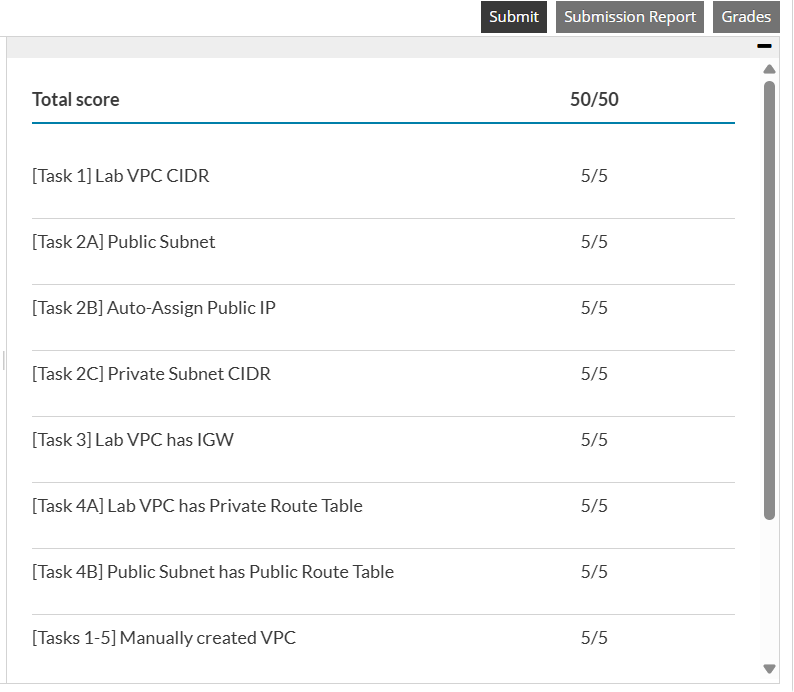
