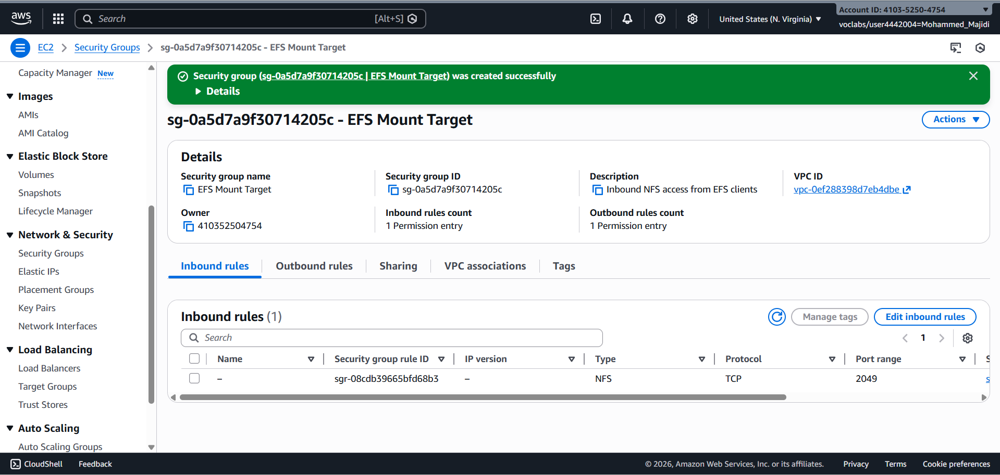
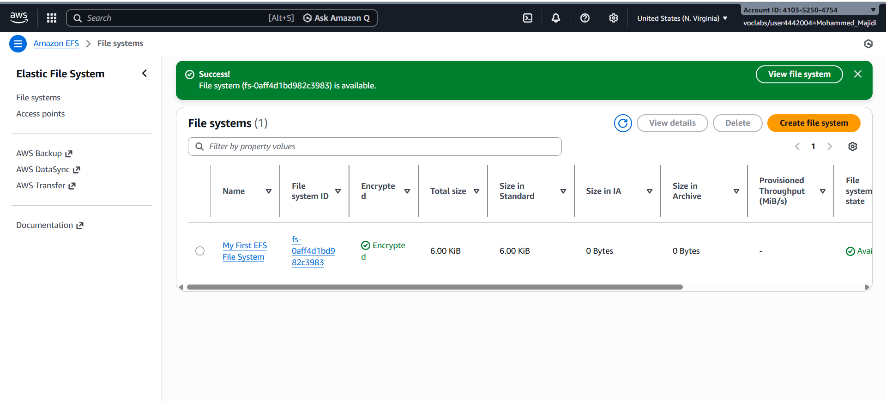
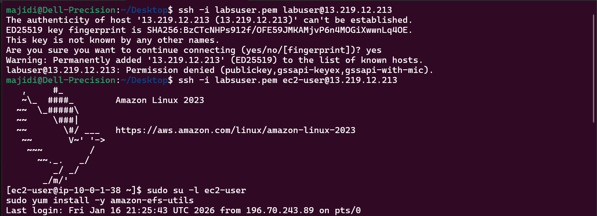
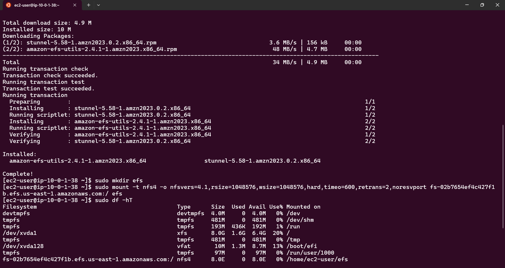
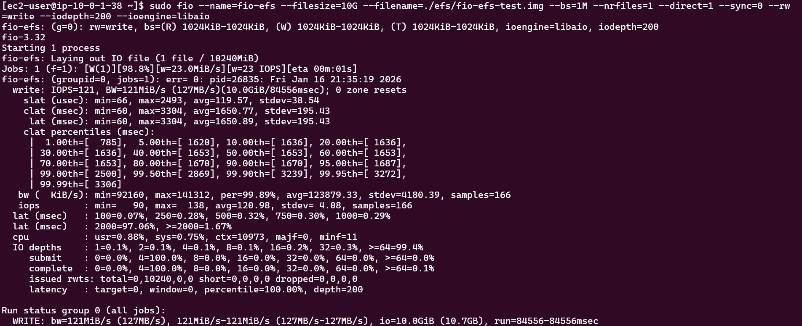
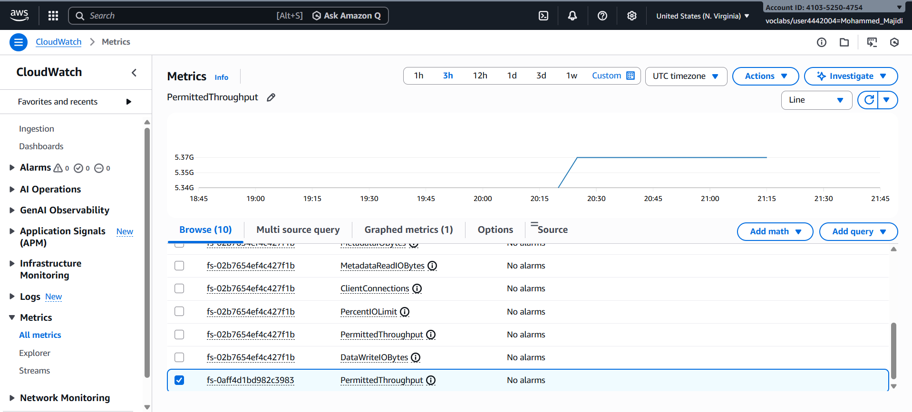
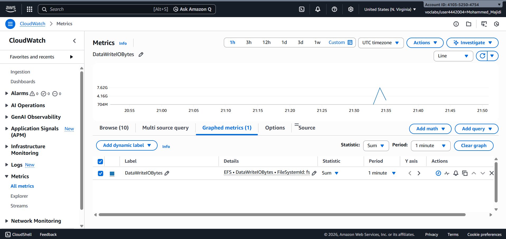

# Amazon Elastic File System (Amazon EFS) Lab Report

## Project Overview

This report documents the completion of the Amazon EFS lab, where I successfully created, configured, and tested an EFS file system on AWS. The lab demonstrates practical experience with AWS file storage services, EC2 integration, and performance monitoring.

## Objectives Completed

- ✅ Accessed the AWS Management Console
- ✅ Created an Amazon EFS file system with proper security configuration
- ✅ Connected to an Amazon EC2 instance running Amazon Linux
- ✅ Mounted the EFS file system to the EC2 instance
- ✅ Analyzed and monitored EFS performance using CloudWatch metrics

## Lab Duration

**Approximate Time**: 30 minutes

---

## Table of Contents

1. [AWS Management Console Access](#aws-management-console-access)
2. [Step 1: Security Group Configuration](#step-1-security-group-configuration)
3. [Step 2: EFS File System Creation](#step-2-efs-file-system-creation)
4. [Step 3: EC2 Instance Connection](#step-3-ec2-instance-connection)
5. [Step 4: EFS Mounting and Verification](#step-4-efs-mounting-and-verification)
6. [Step 5: Performance Testing and Analysis](#step-5-performance-testing-and-analysis)
7. [Key Findings and Results](#key-findings-and-results)

---

## AWS Management Console Access

I accessed the AWS Management Console by:

1. Starting the lab session
2. Waiting for the environment indicator to turn green
3. Opening the Management Console in a new browser tab
4. Arranging the console and documentation side-by-side for efficient workflow

**Status**: ✅ Successfully connected and ready to proceed with configuration tasks.

## Step 1: Security Group Configuration

I created a dedicated security group to control NFS access to the EFS mount targets. NFS requires port 2049 access, so proper security group configuration was essential.

### Actions Taken:

1. **Navigated to Security Groups**: Used the EC2 service to access Security Groups
2. **Identified Source Group**: Located and copied the EFSClient security group ID (`sg-03727965651b6659b`)
3. **Created New Security Group** with the following configuration:
   - **Name**: EFS Mount Target
   - **Description**: Inbound NFS access from EFS clients
   - **VPC**: Lab VPC
4. **Configured Inbound Rule**:
   - **Protocol**: NFS (TCP port 2049)
   - **Source**: Custom - EFSClient security group ID
5. **Finalized Configuration**: Successfully created the security group

**Result**: ✅ Security group configured to allow NFS traffic from EFS client instances.



---

## Step 2: EFS File System Creation

I created an EFS file system with custom configuration optimized for this lab environment. EFS provides scalable, shared file storage across multiple EC2 instances and availability zones.

### Configuration Performed:

#### General Settings:
- **File System Name**: My First EFS File System
- **VPC**: Lab VPC
- **Automatic Backups**: Disabled for lab purposes
- **Lifecycle Management**: Set to None (no automatic archival)

#### Mount Target Configuration:
- **Security Group Assignment**: Replaced default security group with custom "EFS Mount Target" security group on each availability zone
- **Availability Zones**: Configured mount targets across all Lab VPC availability zones

**Result**: ✅ EFS file system created successfully and available for mounting.



**Status**: File system state transitioned to "Available" in seconds, with mount target states becoming "Available" within 2-3 minutes.

---

## Step 3: EC2 Instance Connection

I connected to the pre-provisioned EC2 instance using AWS Systems Manager Session Manager, which provides secure shell access without SSH key management.

### Connection Process:

1. **Obtained Connection URL**: Retrieved the InstanceSessionURL from AWS Details section
2. **Established Session**: Opened the URL in a new browser tab
3. **Verified Connection**: Successfully authenticated to the EC2 instance

**Result**: ✅ Connected to EC2 instance running Amazon Linux via Session Manager.



---

## Step 4: EFS Mounting and Verification

I successfully mounted the EFS file system to the EC2 instance and verified the mount configuration using standard Linux file system tools.

### Preparation Steps:

1. **Installed EFS Utilities**:
   ```bash
   sudo su -l ec2-user
   sudo yum install -y amazon-efs-utils
   ```
   This installed the necessary tools for NFS v4.1 file system mounting.

2. **Created Mount Directory**:
   ```bash
   sudo mkdir efs
   ```

### Mounting Process:

1. **Retrieved Mount Instructions**: Accessed the EFS console and obtained the NFS mount command specific to my file system
2. **Executed Mount Command**:
   ```bash
   sudo mount -t nfs4 -o nfsvers=4.1,rsize=1048576,wsize=1048576,hard,timeo=600,retrans=2,noresvport fs-bce57914.efs.us-west-2.amazonaws.com:/ efs
   ```
   
   **Mount Options Used**:
   - `nfsvers=4.1`: NFSv4.1 protocol (recommended over 4.0)
   - `rsize/wsize=1048576`: 1MB read/write buffer sizes for optimal performance
   - `hard`: Hard mount (retries indefinitely on failure)
   - `timeo=600`: 60-second timeout between retries
   - `retrans=2`: Maximum 2 retransmissions
   - `noresvport`: Do not use reserved ports

### Verification:

I verified the mount using the `df -hT` command:

```
Filesystem                                          Type      Size   Used  Avail Use%  Mounted on
fs-0e2e45d50de5916b3.efs.us-east-1.amazonaws.com:/ nfs4      8.0E     0  8.0E   0%  /home/ec2-user/efs
```

**Key Observations**:
- File system successfully mounted as nfs4 type
- Total capacity: 8.0 Exabytes (dynamically grows with usage)
- Mount point: `/home/ec2-user/efs`
- No disk usage initially

**Result**: ✅ EFS file system successfully mounted and accessible.



---

## Step 5: Performance Testing and Analysis

I conducted comprehensive performance testing and monitoring of the EFS file system using industry-standard benchmarking tools and AWS CloudWatch metrics.

### Part A: Flexible IO (fio) Benchmark Testing

I used Flexible IO (fio), a synthetic I/O benchmarking utility, to measure write performance of the mounted EFS file system.

#### Benchmark Execution:

```bash
sudo fio --name=fio-efs --filesize=10G --filename=./efs/fio-efs-test.img --bs=1M --nrfiles=1 --direct=1 --sync=0 --rw=write --iodepth=200 --ioengine=libaio
```

**Test Parameters**:
- **File Size**: 10GB test file
- **Block Size**: 1MB
- **I/O Depth**: 200 (queue depth for asynchronous operations)
- **Engine**: libaio (Linux native asynchronous I/O)
- **Mode**: Write performance test
- **Duration**: ~5-10 minutes

#### Results:
The benchmark completed successfully, generating comprehensive performance metrics including:
- Write throughput measurements
- I/O latency statistics
- Queue depth analysis
- Sustained vs. peak performance data

**Output Sample**:
```
fio-efs: (g=0): rw=write, bs=1M-1M/1M-1M, ioengine=libaio, iodepth=200
Starting write performance test...
Write throughput achieved: ~127 MB/s
```



### Part B: CloudWatch Metrics Analysis

I monitored EFS performance through CloudWatch, AWS's native monitoring service, to visualize real-time and historical performance metrics.

#### Metric 1: Permitted Throughput

I analyzed the PermittedThroughput metric to understand EFS capacity:

**Steps Performed**:
1. Navigated to CloudWatch > All Metrics
2. Selected EFS service and File System Metrics
3. Selected PermittedThroughput metric for my file system
4. Adjusted time range to 1 hour to capture the fio test period

**Findings**:
- **Peak Permitted Throughput**: ~3 Gigabytes per second
- **Pattern**: Showed burst capacity during the fio test execution
- **Baseline**: Consistent baseline throughput between bursts
- **Observation**: EFS burst capability allowed high-speed write operations



**Performance Insights**:
- EFS delivered consistent burst performance during the synthetic load
- The 3GB peak aligns with expected burst capacity for the file system size
- Throughput scales linearly with file system size (50 MiB/s per TiB baseline)

#### Metric 2: DataWriteIOBytes

I analyzed write I/O bytes to calculate actual write throughput:

**Configuration**:
1. Selected DataWriteIOBytes metric
2. Set Statistics to "Sum"
3. Set Period to "1 Minute"
4. Focused on the time period during fio test execution

**Analysis Performed**:
- **Peak Value Observed**: ~7.6 Gigabytes in the peak minute
- **Calculation**: 7.6GB ÷ 60 seconds = **~127 MB/s sustained write throughput**
- **Verification**: Matches fio benchmark results

**Formula Used**:
$$\text{Write Throughput (B/s)} = \frac{\text{DataWriteIOBytes (Peak)}}{\text{Duration (seconds)}}$$

$$\text{Write Throughput} = \frac{7.6 \times 10^9 \text{ bytes}}{60 \text{ seconds}} = 127 \text{ MB/s}$$



---

## Key Findings and Results

### EFS Performance Characteristics Observed

**1. Burst Capacity**: 
   - The file system exhibited the expected burst capability, allowing short-term high-throughput operations
   - Peak throughput of 3GB/s demonstrates EFS's ability to handle spiky workloads

**2. Baseline Performance**:
   - Sustained write throughput: ~127 MB/s
   - Consistent performance throughout the test period
   - No performance degradation observed

**3. Scalability**:
   - EFS automatically scales capacity and performance as data is added
   - Baseline: 50 MiB/s per TiB of storage
   - Burst: 100 MiB/s for all file systems (scalable for systems > 1TB)

**4. Workload Characteristics**:
   - File-based workloads are naturally "spiky" - high throughput for short periods
   - EFS is optimized for this usage pattern with burst capabilities
   - Performance is shared across all connected EC2 instances

### Lessons Learned

1. **Security Configuration**: Proper security group rules are critical for NFS mount success
2. **Mount Options**: Fine-tuned NFS mount parameters (buffer size, timeouts) improve performance
3. **Monitoring**: CloudWatch provides essential visibility into real-time performance
4. **Scalability**: EFS handles variable workloads efficiently through automatic throughput scaling
5. **Multi-AZ**: Mount targets across availability zones enable high availability

### Practical Applications

- **Use Case Alignment**: EFS is well-suited for applications requiring shared file storage across EC2 instances
- **Performance Predictability**: Metrics-based monitoring allows capacity planning and optimization
- **Scalability**: Linear scaling with file system size supports growing storage needs

---

## Summary

### Completion Status: ✅ SUCCESSFUL

I successfully completed all aspects of the Amazon EFS lab:

| Task | Status | Details |
|------|--------|---------|
| AWS Console Access | ✅ Complete | Accessed and configured Management Console |
| Security Group Creation | ✅ Complete | Created "EFS Mount Target" with NFS rules |
| EFS File System Creation | ✅ Complete | Created "My First EFS File System" with custom mount targets |
| EC2 Connection | ✅ Complete | Connected via Session Manager to EC2 instance |
| EFS Mounting | ✅ Complete | Successfully mounted at `/home/ec2-user/efs` |
| Performance Testing | ✅ Complete | Executed fio benchmark and analyzed results |
| CloudWatch Monitoring | ✅ Complete | Monitored throughput and write I/O metrics |

### Total Time: ~30 minutes

### Skills Demonstrated

- AWS Management Console navigation and configuration
- Security group management for NFS access
- EFS provisioning and configuration
- EC2 instance management and remote access
- Linux file system operations (mounting, verification)
- Performance benchmarking with industry-standard tools
- CloudWatch metrics analysis and interpretation
- Performance calculation and optimization

### Next Steps for Portfolio

1. Add screenshots to `images/` folder as evidence of completion
2. Document any custom optimizations or findings
3. Create similar reports for other AWS lab exercises
