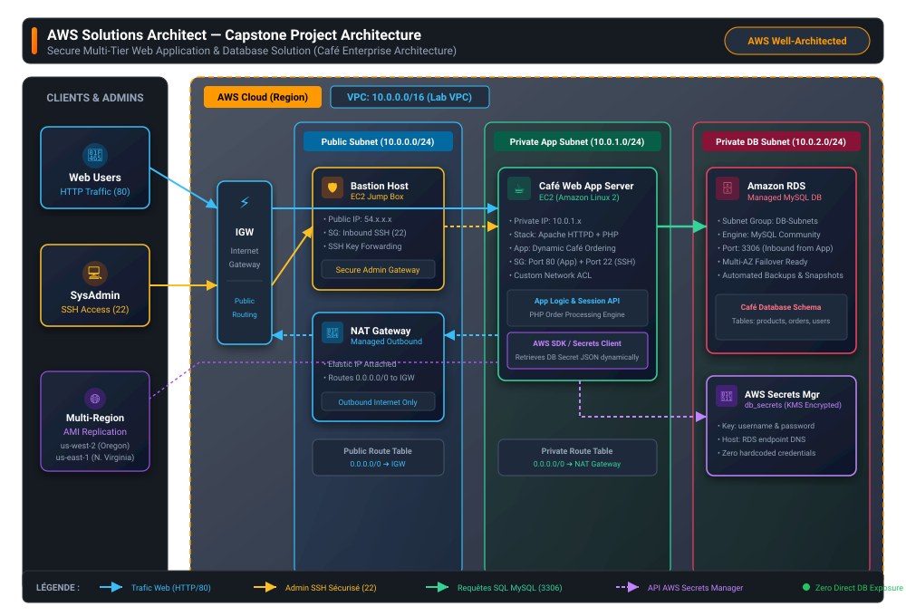

# AWS Solutions Architect — Capstone Project & Labs Portfolio

[](https://aws.amazon.com/certification/certified-solutions-architect-associate/)
[](#-featured-capstone-project-secure-multi-tier-café-solution)
[](#-completed-labs--modules)

A production-grade AWS Cloud Architecture portfolio and graduation capstone project demonstrating end-to-end implementation of secure, resilient, and high-performance cloud solutions aligned with the **AWS Well-Architected Framework**.

---

## 🏆 Featured Capstone Project: Secure Multi-Tier Café Solution

### **Title**: End-to-End Secure Multi-Tier Web Application & Database Architecture on AWS

This capstone project combines and unifies core enterprise cloud patterns into an end-to-end, production-ready solution for a dynamic e-commerce web application (**The Café Ordering System**).

### 📐 Solution Architecture Diagram



---

### 🏛️ Architecture Breakdown & Design Decisions

| Tier / Component | Subnet & CIDR | AWS Services Used | Security & Design Features |
| :--- | :--- | :--- | :--- |
| **Edge & Routing** | Public / Edge | **Internet Gateway (IGW)**, Public Route Table (`0.0.0.0/0 ➔ IGW`) | Direct internet entry point for legitimate user HTTP traffic and admin SSH connections. |
| **DMZ / Public Tier** | `10.0.0.0/24` (Public) | **Bastion Host (EC2)**, **NAT Gateway**, Elastic IP | • **Bastion Host**: Jump box for administrative SSH access with key-forwarding.<br>• **NAT Gateway**: Allows isolated private instances to fetch OS/security patches without inbound public exposure. |
| **Compute / Application Tier** | `10.0.1.0/24` (Private) | **EC2 Web Server (Amazon Linux 2)**, Apache HTTPD, PHP 8+ | • Isolated in private subnet (no public IPv4).<br>• Custom **Network ACL** and **Security Group** restricting ingress.<br>• Dynamic order processing engine with AWS SDK integration. |
| **Database Tier** | `10.0.2.0/24` (Private) | **Amazon RDS MySQL**, DB Subnet Groups | • Decoupled managed database backend.<br>• Restricted inbound traffic on Port `3306` strictly from the Web Application Security Group.<br>• Automated backups and point-in-time recovery. |
| **Security & Secrets** | AWS Regional Services | **AWS Secrets Manager**, AWS KMS | • Zero hardcoded credentials in application source code.<br>• Dynamic JSON credential retrieval over secure AWS API. |
| **Disaster Recovery & Multi-Region** | Cross-Region (`us-west-2` & `us-east-1`) | **Amazon Machine Images (AMI)**, EBS Snapshots | • Standardized AMI creation for rapid environment provisioning and regional failover. |

---

### 🛡️ Alignment with AWS Well-Architected Pillars

1. **Security (Defense-in-Depth)**:
   - 4 layers of network defense: Internet Gateway, Network ACLs (stateless), Security Groups (stateful), and Subnet Isolation.
   - Elimination of hardcoded secrets using **AWS Secrets Manager**.
   - Bastion host architecture protecting the private compute instances from internet scanners.
2. **Reliability & Availability**:
   - Managed relational database with **Amazon RDS** eliminating single-server database failure.
   - AMI-based deployment enabling rapid horizontal recreation across multiple AWS regions.
3. **Performance Efficiency**:
   - Compute and database layers operate on dedicated, right-sized infrastructure connected over high-speed AWS VPC backbone.
4. **Cost Optimization**:
   - Outbound internet consolidated through a shared NAT Gateway.
   - Managed database eliminates licensing and maintenance overhead.

---

### 📂 Capstone Project Modules & Documentation

This capstone project is documented across three primary implementation modules:

1. 🌐 **[Networking & VPC Security Environment](./Challenge_Lab-Creating_a_VPC_Networking_Environment_for_the_Cafe/)**
   - VPC design, public/private subnets, Internet Gateway, NAT Gateway, Network ACL rules, and Bastion Host deployment.
2. ☕ **[Dynamic Web Application & Secrets Manager Integration](./Challenge_Cafe-Creating-a-Dynamic-Website-for-the-Cafe/)**
   - LAMP stack configuration, dynamic PHP application setup, AWS Secrets Manager API integration, and multi-region AMI replication.
3. 🗄️ **[Database Migration to Amazon RDS](./Challenge_Cafe-Migrating_a_Database_to_Amazon_RDS/)**
   - Database schema export from EC2, DB Subnet Group provisioning, Amazon RDS MySQL deployment, data migration, and application reconfiguration.

---

## 🧪 Completed Labs & Modules

| Module / Lab Name | Category | Primary AWS Services | Status | Report Link |
| :--- | :--- | :--- | :---: | :--- |
| **VPC Networking for Café** | Networking & Security | VPC, Subnets, IGW, NAT Gateway, Bastion, NACL | ✅ Completed | [View Report](./Challenge_Lab-Creating_a_VPC_Networking_Environment_for_the_Cafe/) |
| **Dynamic Website for Café** | Compute & Security | EC2, LAMP, Secrets Manager, AMI, Multi-Region | ✅ Completed | [View Report](./Challenge_Cafe-Creating-a-Dynamic-Website-for-the-Cafe/) |
| **Database Migration to RDS** | Databases & Migration | Amazon RDS MySQL, DB Subnets, mysqldump | ✅ Completed | [View Report](./Challenge_Cafe-Migrating_a_Database_to_Amazon_RDS/) |
| **Creating a VPC from Scratch** | Networking | VPC, Subnet, Route Tables, Internet Gateway | ✅ Completed | [View Report](./Guided_Lab-Creating_a_VPC/) |
| **VPC Peering Connection** | Networking | VPC Peering, Cross-VPC Routing, Security Groups | ✅ Completed | [View Report](./Guided_Lab-Creating_a_VPC_Peering_Connection/) |
| **Creating an Amazon RDS DB** | Databases | Amazon RDS MySQL, Security Groups, Client Access | ✅ Completed | [View Report](./Guided_Lab-Creating_an_Amazon_RDS_Database/) |
| **Introducing Amazon EFS** | Storage & File Systems | Amazon EFS, EC2, fio benchmarking, CloudWatch | ✅ Completed | [View Report](./Guided_Lab-Introducing-Amazon-EFS/) |

---

## 🔧 Skills & AWS Services Demonstrated

```
┌────────────────────────────────────────────────────────────────────────┐
│                        AWS SOLUTIONS ARCHITECT                         │
├──────────────────┬──────────────────┬──────────────────┬───────────────┤
│ Networking       │ Compute          │ Database/Storage │ Security      │
├──────────────────┼──────────────────┼──────────────────┼───────────────┤
│ • Custom VPCs    │ • EC2 Instances  │ • Amazon RDS     │ • IAM Roles   │
│ • Public/Private │ • User Data / OS │ • Amazon EFS     │ • Secrets Mgr │
│ • NAT Gateway    │ • Custom AMIs    │ • Multi-AZ DB    │ • Sec. Groups │
│ • IGW & Routing  │ • Multi-Region   │ • EBS Volumes    │ • Net ACLs    │
│ • VPC Peering    │ • LAMP Stack     │ • DB Subnet Grps │ • Bastion SSH │
└──────────────────┴──────────────────┴──────────────────┴───────────────┘
```

---

## 🚀 How to Review and Navigate This Portfolio

1. **Architecture & Design**: Examine the [Architecture Diagram](./images/architecture-solution-diagram.svg) and design choices above.
2. **Deep-Dive Reports**: Click any of the report links in the table above to view detailed step-by-step procedures, configuration parameters, and verification tests.
3. **Visual Proofs**: Each lab directory contains an `images/` folder with console screenshots confirming operational status and testing results.

---

## 📜 Attribution & Verification

- **Program**: AWS Solutions Architect Associate (SAA) Training & Hands-On Challenge Labs
- **Standard**: AWS Well-Architected Framework
- **Deliverables**: Solution Architecture Diagram + GitHub Repository Documentation
